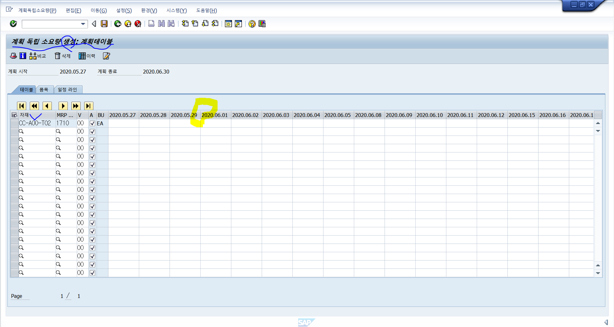

# 0527

* 올려주신 자료 챙겨 보기
* 입고 출고 외

&lt;구매오더 후 생산입고가 얼마나 됐는지 원재료 출고는 얼마나고 고객으로부터 주문은 얼마나 받고 얼마나 팔았느냐 ? 또 마감 작업 &gt; 만약 100개를 발주했는데 50개가 남아서 다음달로 이월 시켜주기&gt;

### migo -  입고를 확인하는 t-code 

### sap menu 물류&gt;자재관리&gt;재고관리&gt;상품이동&gt;migo가 있음

migo에서 입고, 재고이전\(플랜트, 저장위치, 상품치환\) 등 모두 가능 

migo에 가면 입고, 반품, 취소, 출고 등등 을 선택해 할 수 있음 , 저장소에서 반출이라는 이동유형이 있는데  일단 꺼내 놓고 움직이고 있다는 운송중의 재고라는 뜻으로 해석하면 된다. 외부에 있는 이동중인 재고를 갖고 오면 저장소에 반입이라는 이동유형으로 한다. 보통이 두개를 동시에 사용 311이동유형처럼 이것은 자재문서는 있지만 회계문서는 없다. 위치만 바뀌고 있는 것 , 저장소에서 반입/반출은 item라인에 하나만 생김 GI/GR  

구매오더를 갖고 입고를 입력? 해주기 \(발주시킨거를 당근 입고로 들어오니까\) 근데 꼭 구매 오더로만 입고될 수 있는 것은 아니다 자재문서로도 되고 입하 출하 예약 등 /

R04 납품 일정 계약 - 특정 업체와 특정시기로 거래 계약을 해놓고 구매오더를 건건이 발행하는 것이 아니라 그계약하나를 갖고 계속 물건을 입하 할 수 있다. -&gt; 구매오더 없이 입고를 하는 것  

R09 예약 - 회사내부 A부서에서  ㄱ자재를 언제 사용해야한다라고 예약해 두는 \(미래에 사용\) 

**전기일**이 중요하다. 실제로 장부에\(sap 시스템\) 업무 행위가 발생한 날짜, 물건이 입고되거나 출고 되거나 하는 날을 기록, 실제 업무와 다른 날일 수도 있지만 ... 암튼 전기일을 기준으로 평가를 한다. 예를 들어 월마감을 할 때 어떤 기간동안 발생한 트렌젝션을 종료하는 것인데 

* F8실행 대부분 실행됨

sap 문서 대부분은 이 레벨로 나눠짐 **헤더레벨**- 공업체, 구매 조직 **아이템레벨** - 어떤 물건을 언제까지 받느냐  헤더레벨과 아이템 레벨 두개의  자료가  있다.

item레벨에 품복 ok라는 체크박스가 있음 세부데이타를 볼 수 있음\(헤더레벨에도 있음 ok코드\) 꼭 ok를 찍어줘야 됨

\(마감을 하면 지난 일자는 닫히고 기간오픈을해서 이번달꺼를 열어둠 지난건 못 바꿈 sap standard 이동유형은 계정이 다 연결 돼있음, 원가요소는 계정들로 게산했을 때 어떤 손익이 있는지를 확인할 수 있음\)

점검을 눌러서 확인하는데 수정을 할 수 있는 기간이 지나면 이렇게 못한다고 뜸

품목 상태는 초록색인데 전체상태는 빨간색

회사 재고 자산이 바뀔 수 있는 \(물류에 영향을 주거나 장부가 서로 맞지 않을 수 있을 때 블락을 걸어서 전기일 같은 것을 바꾸지 못하게\) 무시하고 전기를 누르면 아래와 같은 메세지를 볼 수 있다.

#### 자재문서 5000004181을\(를\) 전기했습니다

회계 전표 돈의 흐름, 자재 원장 계정들의 집합 &gt; A04조회로 하고 r02자재문서 5000004184로하고 회곔문서 보기 

\*자재문서가 담기는 테이블 mkpf\(자재문서번호 전기일 증빙일\), mseg\(자재 별로 이동유형, 플랜트, 판매분서, 품목번호, 품목에 대한 정보들\) 알아둬야함 &gt; bkpf\(\)와 bseg\(계정상세 - 금액\)와 연결 돼 있음 근데 mseg에서 다 볼 수 있게 hana로 바뀌면서 바뀌었음 단가 \* 수량 = dmbtr - 엠세그의 항목 비세그와 다름 비세그가 더 정확  dmbtr의 단가는 업체와 거래되는 가격 \* 수량 = 어마운트가 dmbtr인것

### &lt;생산 PP모&gt;

p120~

&lt;단속생산방식의 생산흐&gt;

1. 계획오더
2. 생성오더
3. 작업공수
4. 오더승인
5. 페인팅
6. 대기상태+출고
7. 작업수행
8. 확정
9. 입고 - 완성품을 재고자산으로 등록하는 것

어떤 완성품을 만드는 과정에서 각각 필요한 부품을 갖고 작업공정과정을 거쳐서 완성품을 만드는데, 이때 완선품의 코드와 각각의 부품의 코드가 있는데 완성품은 a는 부품 b 1개 부품 c 2개 가 필요하다 &gt;  BOM / 부품 b는 몇번 단계에서필요하고 c는 몇단계에서 몇시간 필요하다 &gt; 공정

PIR\(계획독립소요량\): dm이라는 수요관리 품목이 있는데 어떤 항목을 얼마만큼 필요하다, PIR은 계획수요량을 직접 등록 할 수 있는 것,  b라는 부품이 몇개 몇시간 필요한지를 계획을 등록하는 것 완성품 A의 그자체이다.  사용자가 직접 등록

DR\(종속된소요량&gt; PIR에 종속됨\): 각각의 부품을 말하는데 A에 대한 계획이 있어야야 부품에 대한 제안을 해줄 수 있음 &gt; 필연저긍로 발생하는 하위 구성품들의 소요량에 대한 제

**SAP 메뉴 물류&gt; 생산&gt; 작업현장관리&gt; 오더&gt; 생성&gt;생산계획&gt;수요관리&gt; 계획독립소요량**

PBIM, PBED 테이블에서 회사를 입력해 자재 코드를 찾을 수도 있음

자재이름으로 계획을 생성할 수도 있고 제품그룹 소요량 계획에 따라 소요량을 정할 수 있다. 플랜트를 적어주고 버전을 지정할 수도 있다. 계획기간도 지정가

cc-a00-t02

작업 화면

공장달력에 지정된 주말은 날짜가 없는 것도 확인가능 휴일이 등록되지 않아있으면 다 나옴  
저장을 하면 PBIM, PBED에서 소요량 확인 가능

PBIM table조회해서 필드탭에서 속성 들을 봄, 

PBI를 생성하면 PBIM이랑 PBED에 데이타가 쌓임  각각의 테이블이 연결돼야 하기 때문에 키필드를 체크를 해야함 , 두개의 테이블을 각각의 독립소요량 번호를 키로 갖고 있기 때문에 같은 번호를 입력하면 같은 테이블을 볼 수 있음, / 한쪽에서 키인데 한쪽에서 키가 아니라면 조인구조로 만들어야한다.

퀵 뷰어 SQVI =&gt; 테이블 조인하는 조건을 입력하면 레포트프로그램으로 보여줌  

테이블결합을 선택해서 퀵뷰어 하나 생

퀵뷰어를 보면 PBIM, PBED테이블이 링크돼 있는 것을 볼 수 있음.

조회조건을 걸어준다.

결과 화

과제: 퀵뷰어로 조인해서 \(ekko,ekpo 같은 것\)  

\*SPRAS \(언어키\)라는 필드가 있음 어떤 테이블을 가도 언어는 이걸 씀. 자재내역 MAKT라는 테이블에 같은 자재코드를 같고 다른 언어키를 주어서 동일한 데이타를 여러개로 분리할 수 있음 / 퀴뷰어는 아이디 마다 달라서 코드 겹쳐도 됨

언어키 테이블 조인 링크랑 선택조건이 가장 중요함 리스트는 내가 보고 싶은걸 체크하면됨 / 선택필트 체크 박스 &gt; 선택조건은 특별한 조회조건을 지정하는 것인데 데이타를 추출해서 걸리는 시간이 오래 걸리기 때문에 선택조건을 주는 것이다. &gt; 많이 입력할 수록 좋다.  &gt; 조인과정에서 많은 선택지를 주는 데 그 중에 많은 데이타를 추출하거나 하나씩 하나씩 추리거나 해야함

## &lt;마스터데이타&gt;

#### 마스터 데이타\(기준정보\) - 자재마스터 &gt; 기준정보 

* 각 트렌젝션이 꽂히고 어떤 데이타가 꽂히는지를 알면 됨

### 1. 자재 마스터 

### \(mm01 생산&gt;마스터데이터&gt;자재마스터&gt;생성\(일반\)\)

1. 자재 마스터 생성 &gt; mm01에서 한다. 
   1. 자재코드는 40자리까지 할 수 있음, 
   2. 인터널\(sap시스템에서 추천하는 \), 익스터널\(직접지정\) 두가지 방법으로 코드 지정할 수 있음\(보통 익스터널\)  \(cc-a00-r01&gt; 익스터널 \)
   3. **내 자재코드 CLSAP30-FERT-01, CLSAP30-FERT-02**
   4. 만든 자재코드와 똑같이 하나 더필요하면 이름을 바꾸고 복사원본에 원래 자재코드하고 조직레벨을 그 코드와 똑같이 지정해주면 됨.
2. 자재유형
   1. 제품, 반제품, 원자재 같이 자재의 속성을 정의하는 가장 큰 분류를 나타
      * code: **F**ERT 제품 = 완성품 Finished goods
      * code: **H**ALB 반제품 = 부품을 갖고 몇단계만 거친  \(자동차의 핸들 핸들하나만 파는 것이 아니라 핸들을 붙여서 자동차를 만들어서 파는 것\) semi fin goods
      * code: **R**OH 원자재 = 가공이 전혀 안된 자재 우리 회사에서 만들어내는 품목이 아니다. 뭘 만들기 위해 조달해오는 부품들 ex\) 원료, 생산에 투입되는 외부에서 갖고 오는  것 Raw material
      * code: **HAWA** 상품: 제품과 상품은 다름 , 제품은 우리가 가공해서 최종단계를 마친것, 상품은 다른 곳의 완제품을 사와서 팔기만 하는 것  trading goods
      * 이것들도 각자의 유니크한 코드가 있음 4개 코드 꼭 외우기 / 구매 생산 영업 모두를 위해 제품, 반제품, 원자재를 하나 씩 만들 예정 &gt; 3개가 있어야 BOM을 구성할 수 있음

mm01에서 생성 산업 부문 보통 m 코드안보이면 로컬레이아웃에서 시각화지

**뷰 선택**

1. 뷰선택 또는 엔터치면  팝업같은게 나옴 거기서 자재코드가 담는 정보의 종류를 결정하면 됨 \(조직구조, 회사코드, 플랜트, 저장위치, \) 이 서버에 어떤 구조와도 관련 없지만 꼭 필요한 데이터만 담는 것 **기본데이타 1,2** 
2. **영업1,2** = 영업조직에 따라서 특별히 관리 돼야하는 값이 모인 것\(회사코드는 같은데 플랜트가 다른경우 뷰를 플랜트만큼 늘려줘야함\) 
3. **mrp1,2,3,4** &gt;  mrp는 다른 뷰와 다르게 사용목적에 따라 1~4까지 나뉨 조달 방법 생산할 건지, 구매할건지, 생산전략+소요량 조정, 뷰엠의 방법 / mrp뷰는 플랜트를반드시 참고 해야함 = 플랜트마다 mrp가 있어야함 
4. **작업일정계획** &gt;  생산에만 해당되는 내용 / 플랜트마다 있어야함 
   1. 생산오더 작업일정계획 사용
   2. 반복제조 연속제조는 사용하지 않음 
   3. 장치산업 작업일정계획 사
5. **회계1,2** &gt; 자재 가치평가 기준을 담음
   1. 평균원가
   2. 이동평균
   3. 물류는 플랜트 회계는 회사코드가 담고 있음 하지만 자재마스터의 회계코드는 플랜트에 영향을 받는다. 
6. **원가계산1,2** &gt; 실제원가과 목표 원가의 차이를 분석해주는 값 /처음 자재세팅을 할때 자재 유형별로 뷰를 나누는데 FERT는 구매하지 않는 거라서 구매뷰가 들어가지 않음 하지만 HALB는 구매가 들어가고 작업일정계획이 없음
7. 대부분의 자재는 이 위에 뷰들은 보통 들어간다.

**조직레벨**

1. 유통경로, 영업조직 선택해야하고 플랜트\(1710\)에 영향을 받는 뷰들이 있기 때문에 플랜트도 지
2. 저장위치는 창고관리 뷰를 선택했을 때 
3. 영업조직 편의상 1710으로 함
4. 엔

**데이타 입력 화면 \(이게 BDC화면인 것 같음 \)**

1. 기본데이터  
   1.   내역\(어떤 자재인지\)
   2. 단위\(재고관리를 위해 어떤 단위로 할\)
   3. 자재그룹\(어디서?\), 기존자재번호\(해도되고 안해도 됨 = 예전에 이자재는 뭐로 불렸었다.\), 
   4. 제품군\(영업에서 중요한 필드, 제품 구분 값을 갖고 , 영업 조직, 플랜트를 갖고 하기도 함\) , 
   5. 제품계층구조\(sd, co에서 많이 사용하는 필드 단식으로 분석 단계를 만들어 주고 분석할 수 있게 해줌 문구류&gt; 필기류&gt; 볼펜류 &gt; 유색 ,무색 이런 식으로 계층구 를 나눠 각각 계층의 속익을 분석 
   6. 플랜트간 자재 상태 &gt; 모든 조직구조에서 동일한 자재 상태
   7. 일반품목범주 GR: 재고관리품목인지 아닌지 \(영업이나 BOM구성시 체크가 반드시 필요함\) 
   8. * 운송수단에 따라 중량과 볼륨을 관리해야하기도 함
2. 기본데이타2 여기서는 아무것도 입력 안
   1. DG 지시자 프로파일 &gt; DMS 기능영역에서 사용하는 것 같은 외부의 데이타?를  내부에서 사용할 수 있도록 만들어 주는 기능/ 설명만 하심
3. 영업1
   1. 국가에 따라 세금에 대한 부분이 다름 / 기본단위 제품군은 기본데이타에서 입력한 대로
   2. 자재코드를 사용하는 각각의 영업조직, 유통경로마다 세금이나 다른 부분이 다를 수 있다. &gt; 자재코드는 동일해도 조직구조마다 다름
   3. 판매단위를 입력함 &gt; 판매단위는 영업과 관련있음 &gt; 판매할 때는 한 박스나 묶음으로 판매할 수도 있기 때문에 판매단위를 설정해야함 &gt; 재고단위랑 다를 수 있음
   4. 납품 플랜트 &gt;  주문, 딜리버리오더, 납품문서 만들때 어디서 나가는가를 미리정해주는 것 
   5. 세금 &gt;  국가 별로 \(우리나라는 매출 부가세 같은게 자동 지정돼 있음\)
      1. 세금 분류
         1. 0영세 = 보류 \(사료, 농수산물 같은 1차 원료에 대해\), 면세 = 매출부가세 면제
         2. 1과세 = 부가세 정상적으로 매기는 것
         3. 2하프텍스 반과세
4. 영업2
   1. 계정지정그룹 &gt; 만드는 자재가 판매 됏을 때 어떤 계정그룹으로 1차 어싸인 되는가 = 자재유형별로 만들어 주는게 일반적
   2. 품목 범주 그룹 &gt;  일반품목과 동일하게 사용해함
5. 영업3
   1. 가용성 점검&gt; 개별점검, 일일점검, 일괄점검 &gt; 이자재를 쓸수 있는지를 판단하는 기준을 점검 
   2. 주문을 받는데 주문1~15를 납품 받았을 때 미래에 들어올 재고까지 합펴도 15개인데 물건은 20개고 주문건은 5개씩 3개임 / 필요로하는 총수량 이 있는지 확인, 만약 10개박에 재고가 없다면 세일즈 오더가 불가능 &gt; 미래 예상 주문까지포함해서 판매가 가능하느냐를분
   3. 운송그룹, 적재그룹 &gt; 어떤 운송수단을 이용하며 운송수단에서 어떻게 적재되느 
6. MRP1
   1. mrp유형 &gt; mrp를 사용하느냐 안사용하느냐pd를 설정
   2.  \*mps와 mrp의 차이 = 범위 &gt; 단일레벨\(BOM레벨\)일 경우 상위 품목과 바로 하위에 있는 것만 계획해보고 싶을 때 사용 MPS 
   3. BOM구조 &gt;완제품 FERT = 0 level &gt; 그 완제품의 구성품인 RAH B , c= 1 level &gt; HALB C를 구성하는 부품인 ㄱ,ㄴ,ㄷ는 1의 1레벨이지만 A를 기준으로 보면 ㄱ,ㄴ,ㄷ는 2레벨 
   4. 여기서 A즉 완제품 = FERT는 PIR이됨 독립적계획소요량 
   5. mrp를 통해서 각 레벨마다 계획을 수립해볼 수 있다. 
   6. 계획타입팬스 지정한 날까지는 계획을 변경하지 않겠다는 것 , 만약 999면 1~999일까지 계획 안 변경
   7. MRP관리자 &gt; mrp수행후 결과값을 집계하는 값
   8. 로트크기결정절차&gt; mrp유형 PD의 경우 반드시해야함 일자별 수량 월별 수량 주간 수량 &gt; 기간으로 할 때도 있고 &gt; 로트를 바꾸면서 구매오더가 몇개가 만들어지는지 보면 이해하기 쉬움
7. MRP2 
   1. 조달유형 3가지 &gt; 표준원가 측정하는데 필요하는 정보 &gt; co에서 사용하는 것 
      1. e &gt; 내부생산 &gt; e로 설정시 따라와야하는 기준정보 BOM\(재료비\), 라우팅 \(제조비\)= 공정이 필요하기 때문에  &gt; bom에 의해 어떤 품목이 물건을 만드는데 소요된다 그 재료비를 산출 각각 개별 품목들의 재료비로 필요함 / 라우팅 &gt; 제조 경비 = 재료에 대한 작업, 인력비, 설비를 위한 전기, 용수, 환경, 감가상각비 등등을 산출해야함 라우팅으로 그걸   **생산품\(반제품은 E일때도 있고 X일 때도 있음\)**
      2. f &gt; 외부조달 외부에서 우리 회사로 들어온 물건 &gt; 설정시 따라와야하는 기준정보 구매단가가 필요&gt; 사오는 경우 물건이 들어오기 때문에 &gt; 물건의 가치는 구매단가로 정함  **원자**
      3. x &gt; 내외부 조달 모두 가 &gt; BOM, 라우팅 or 구매정보레코드 둘중 하나가 있어야 함 &gt;  순서가 있음 bom,라우팅을 먼저 보고 없으면 구매단가를 찾고 있는게 표준원가로 결정됨.
   2. EP저장위치가 세팅돼있으면 자동으로 추천? 해줌 어디에 입고해야하는지 &gt; 변경은 가능 
   3. 생산저장위치&gt; 원자재면 출고 , 생산품이면 생입고 
   4. 일정계획&gt; 워킹데이기준 0~999까지 0일은 오늘 
      1. 계획남품소요시간 &gt; mrp수행시 들어가는 값
   5. 일정계획마진키 &gt; 오더와 오더 사이에 즉 단계사이에 여유기간을 얼마를 줄거니 &gt; 일정에 대한 여유기간이다 / 개시기간은 살짝 다른데 구매품에 대해 계획오더를 자동으로 만들어줄 때 \(mrp가 계획부터 자동으로 만들어주는데\) 구매품의 경우 계획을 건너서 구매요청을 할 수 있어서 개시로 바로 들어감 
8. mrp3
   1. 가용성점검은 위와 같음 02
   2. 전략그룹&gt; 편의상 생산전략이라하는데 실제로는 재고를 만들어내는 수급하는 방식을 말하기도함,  직접계획대상만 PIR을 등록하는 것 있으면 됨 \(완제품만 있으면 됨\)
      1. sap의 전략 두가지 재고를 갖고 생산하는
         1. mts &gt; make to stack:재고를 갖고 생산하는 방식&gt; 즉 PIR**소요계획이** 있어야 가능한 것 &gt; 전략번호 10 = 위험성이 있다 계획을 잘못 수립했다 &gt; 불필요한 재고가 쌓일 수 있음
         2. mto &gt; make to order:주문을 받고 생산하는 방식&gt; 고객의 주문후 부터 후속 시스템이 진행됨 원자재를 사오는 것도 주문을 받고 나서 할 수 있음 대신 **주문번호**가 항상 따라다님 주문에 의해 생산, 구매, 판매가 가능 &gt; 전략번호 20 &gt; 주문후에 생산돼서 오래걸림
9. mrp4
   1. 개별/일괄 &gt; 하루하루쪼개서 볼지 일괄로 볼
   2. 반복제조 체크할지 말지 &gt; 반복제조면 체크 생산오더는 하지 않음 
10. 작업일정계획 &gt; 미달 남풉 허용 
11. 회계1 :자재가 갖는 금액에 대한 속성, 회사코드가 아닌 플랜트별로 설정할 수 있는 값 &gt; 원가평균을 구하는 것
    1. 평가클래스: 7920 FERT, 7900 HALB, 3000 ROH, 3100 HAWA &gt; 평가계정 관리하는 세팅 정해진 것
    2. 가격관리\(한달기준\): 표준원가냐 s /이동평군가냐 v 이걸 정하는게 중요함 회계 관련된 것을 바꿀 수도 있음 / 이동평균가\(원재료\) / 생산품은 표준원
    3. 자재가격결정 : 2 s 이동평군가에 영향을 받음 / 3는 V 표준평가에 영향을 받음
    4. 가격단위: 어떤 가격으로 책정하겠다. 수량에 대한 기준 
    5. 표준가격 &gt; 빈값으로 &gt; 이자재가 갖는 다른 기준정보를 갖는 구조적성격으로 정해 
12.  회계2는 잘 안씀
13. 원가산1: QS포함 원가추정, 원가키, 자재원산지를 봄
    1. 자재원산지: 항목화하여 원인을 분석하거나 하지 않겠다는 것을 체크 목표원가가 결저어되고 실제원가와 차이가 어떻게 되는가를 어덯게 보여줄까를 함
    2. 조달유형이 갖는 후속 기준정보, PIR, bom/라우트등 
    3. 손익센타: 물류와 연결됨 &gt; 이 물건이 nn움지깅며 발생하는 계정에 대한 금액을 그룹으로 묶어 그룹을 분석하는 것 &gt; 계정들의 금액을 모아 주는 것이다.
14. 원가계산2:
    1. 계획가격&gt; 직접금액을 입력하거나 입력하는 경우는 정산적으로 계획가격을 등록해서 표준원가를 지정할 때 씀 bom/라우팅을 모를 경우 강제로 가격을 지정해서 사용하는것
15. 구매뷰를 따로 만들어 봤다. 

**자재마스터 만들어 보기 끝---------------------------------------------**

   

\*BAPI는 이런걸 자동으로 만들어줌 내용만 알고 있다면 테이블에 데이타를 꽂으면 돼서 쉬움  / BDC와 다

\*t006이라는 테이블이 있다 &gt; 단위관리 하는 테이블 

