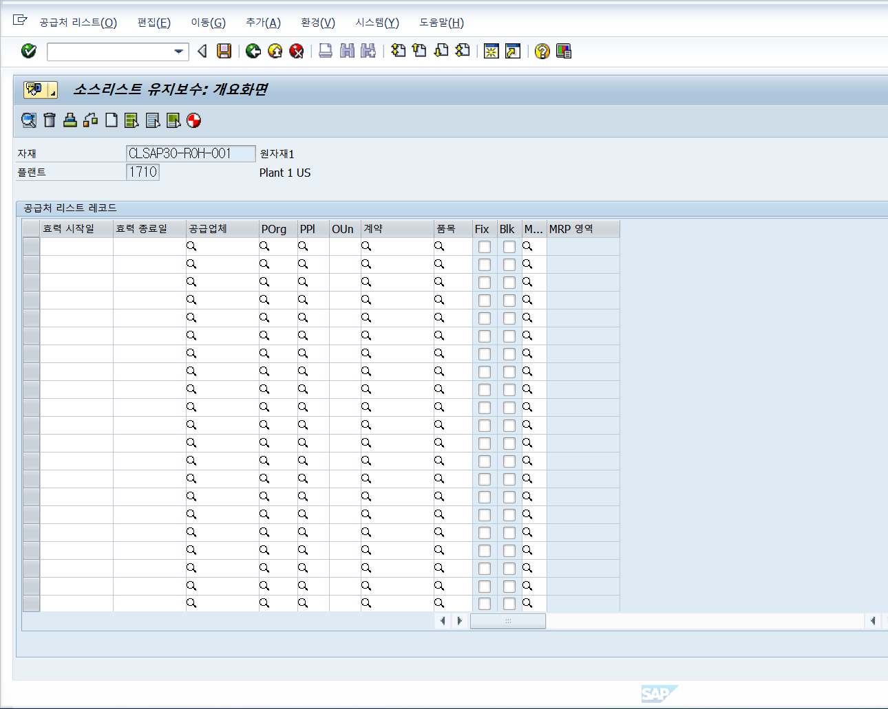

# 0528

## &lt;오전 - 자재마스터 \(자제유형 2개 만들기 완제품하나 반제품하나 원자재하나 \)&gt;

 t-code : mm03\(자재조회 - 설정조\) , mm06\(자재조회리스트 - 데이타 조회\) tip ctrl+Y하면 한 셀만 선택됨 자재 코드 복붙할 때 유용

#### 반제품, 원자재는 팔지 않기 때문에 영업을 선택하지 않음

각각의 자재는 어떤 뷰를 사용하고 사용하지 않는지?

* SPRO에서 볼 수 있다&gt; 아래 참조 IMG에 물류-일반&gt;자재마스터&gt;기본설정&gt;자재유형&gt;자재유형속성정=를 선택하면 같은 메뉴를 사용하는 다른 사용자들이 사용하지 못하도록 락을 걸어줌 
* 락을 걸고 자재유형중 퍼트를 클리해서 세부사항을 열어 
  * &gt; 사용자부서에서 사용할 수 있는 뷰들을 지정한것을 볼수 잇음 &gt;
  * 가격관리에서 기본적인 설정을 표준원가 s로 된것을 볼 수 있
  * 위같이 세팅을 할때 주는 값을 설정할 수 있음

* 테이블로 필드값을 확인하는 것 / 자재마스터생성과 관련된 테이블을 se11에서 조회해보자 \(20개정도인데 5~6개을 주로 사용\) MARA\(기본데이타\), MARC\(구매, 플랜트데이타, 영업의 플랜트 정보,회계정보의 일부 - 주로 플랜트에 들어가는 데이타\), MVKE\(영업관련\), MBEW\(회계원가, 회사코드와 연결된 회계기준의 관리조직\), MAKT\(자재내역, 자재항목\), MALN\(영업부의 세금데이타\), MARM\(기본단위 ,출고, 판매 단위 등등 적어도 5개의 단위를 갖고 - 단위간의 치환도 갖고 있\) 이게 주로 사용하는 테이블  
* 각각 테이블 직접 조회해보기 - 퀵뷰어로 링크도 보기
  * MARA - 기본 데이타, 자재마스테 만들때 넣었던 정보들과 시스템이 자동으로 주는 값을 갖고 있
  * MARC - \(조직구조 - 플랜트 포함\) 마라에 있던 자재 코드를 복사해서 조회해볼 수 있음 &gt;
  * MAKT - 언어키가 있음 언어키를 
    * MAKT - SPRAS = SY-LANGU &gt;&gt; 시스템에 로그인한 언어로 갖고 와라

---------------------------------------------------------------------------------------

양식에 맞춰 엑셀로 업로드 하기 위해 **BDC\(화면을 따라가는 화면 구성 방식\)**와 **bapi\(테이블에 직접 데이타를 꽂을 수 있음\)**를 할 수 있는데 bdc레코딩하기 실습 해보겠다~~ CBO \(sap표준이아닌 데이타를 저장해놓을 수 있는 tab\)\\\

### &lt;BDC는 아니지만 BDC를 위한 트렌젝션 레코딩&gt;

자재하나 만들고 시스템&gt; 서비스&gt;빠른입력&gt;리코더에서 신규기록 \(기록 코드 : clsap30-mm01/트렌젝션코드 mm01&gt;기록시작 누르기\) &gt; 이렇게 하면 자재생성하는 모든 내 액션이 기록 \(엔터같은것\)  &gt; 일반 자재생성하듯이 생성하고 엔터가 아닌 저장을 누르면 레코딩화면이 나타난다. 

이 코드들을 보면서 아밥 코딩하면 편함 

뒤로 가기 후에 다른 코드를 입력해서 똑같이 스텝을 밟아서 생성도 가능 

자재코드를 바꾸고 계속 엔터를 누르면 아까 생성한 자재와 똑같은 스텝을 밟으면서 새로운 자재마스터데이타가 생성

## &lt;Bapi&gt;

데이타를 대량으로 DB에 등록할 수 있는 방법 중하나 

BAPI t-code: se37 = 그냥 BAPI라고 치면 function module전체는 아니지만 자주 쓰는 fm를 볼 수 있음 \(function module\)

BAPI = 각각의 업무 function들을 모아둔 것이라고 생각하면 됨

BAPI\_MATERIAL\_SAVEDATA = 라는 function module이 있음 \(mara 같은\)테이블에 값을 자동으로 넣을 수 있 

자재마스터같은 건 뷰도 다르고 요구되는 필드가 달랐는데 그거에 대한 bapi도각각 요구하는 값이 구분지어 있음 bapi의 tab에서 확인가능 / single parameter나 구간값으로 요구 받기도 하지만 import가 대게 사용됨 / 

se37에서 BAPI\_MATERIAL\_SAVEDATA 를 치고 각 항목에 값 넣기 

여기서 값을 지정해주면 바로 테이블에 값이 들어감

\*import는 단일값이 대부분 str구조면 한줄씩, 필드도, TAB도 임포트 가능 

bapi를 실행해서 얻은 결과값\(S\(썩세스\)또는 E\(에러\)\)을 갖고 다시 한번 업데이트 해주는 과정이 필요 =&gt; 그게 commit, rollback 과정 

**결과가 S의 경우 BAPI\_TRANSACTION\_COMMIT\(업데이트\) , BAPI\_TRANSACTION\_ROLLBACK\(삭\) 이테이블에 결과를 넣어 줘야함** 

BAPI는 테이블에 값이 직접들어가기 때문에 테이블에 대한 지식이 더 많아야함 / BDC는 화면 제어를 많이 못하고 돌발상황 통제도 어려움 그래서 관리가 더 어려움 비디씨가 

**실제로 바피 결과 값을 더 넣주기 시작** 

SE37에 FUNCIOTN MODULE&gt; Execute&gt;test Sequence 에서도 똑같이 만들 수 있음.

실행 후 return에서 자재가 생성된 것을 확인하기&gt; 뒤로가기 눌러서 commit완료된 것 확인하기

### 자재에 대한 데이터를 생성하고 대량으로 처리하는 레코딩 테이블에 바로 데이타를 넣는 baip + 퀵뷰어까지 했다.

## &lt;BOM-구매관련&gt;

BILLS OF MATERIAL &gt; 모품목 구성표 = 하나의 생산품에 대해 어떤 품목이 얼만큼의 소요량으로 상위품을 만들어 낼 수 있는가? 에대한 것 상위품\(생산품 조달 유형이 E인 것\)과 그의 부품에 대한 것 /구매품인데도 bom을 요구하는 것도 있음 / sub -contract 무상사급? 이라는 개념이 있음 단순 구매가 아닌 우리가 생산가능하지만 외주에 생산을 맡기는 것 우리 회사가 다시 구매해서 협력사에 부품을 그냥 주고 \(무상지급\) 그 부품이 포함된 생산품을 사와서 쓰는 것?  &gt; 업체가 만들어서 우리가 사오는 것 

**조달유형 : F**  이면서 **특별조달유형: 30** 인것 &gt;&gt;&gt;**이것은 구매품임에도 불구하고 하위에 품목을 우리가 구매하고 업체에 무상으로 제공하는 것 이기 때문에** **BOM을 갖는 다**. 

**t-code : cs01 bom생성**

bom용도12개가 있다. 보통 5개 정도를 사용 &gt;  1,2,5,6,4 

1&gt; 생산 \(많이 사용/ 사용 용도가 다름 표준원가, 부품출고를 하는데 / 뚜껑과 몸통을 각각 다른 라인으로 생각하면 하나의 볼펜을 만드는 것 \),  / 실제원가 6번 없을 때 원가측정도 같이 함  생산할 때 쓰는 것 

2&gt; 설계 / 연구개발용, 

4&gt; 설비 pm모듈과 관련 / 한설비에 대한 설비 구성표 

5&gt;영업\(생산과 영업 bom은 사용 용도가 영업은 모품목 자품목은 동일하나 주문오더 세일즈오더를 만들때 영업 bom이 있는 구성품을 만들면 서비스 부품의 용도로 사용 \), 

6&gt;  원가 bom  원가계산을 위해서만 사용한다. 부품 출고가 없음 6번이 없다면 1번으로 원가계산을 함 하지만 있다면 6번으로 하는 것이 우선 / 표준원가 그 자체  = 목표원가랑 다름

효력시작일 &gt; \(보통을 월에 1일 설정을 많이 함\)생산들어간 시점부터 효력시작일 까지 생산 출고를 못함  ex\) 효력시작일 5/1 생산은 4/28 이라면 실제 출고 가능한 날은 4/28일 이더라도 , 생산입/출고는 5/1일 부터 가능함 

**&lt;BOM 생성&gt;**

**안어려움 모품목을 얼마나 생산할 것이냐에 대한 구조를 만드는 것** 

자재코드 밑에 줄있는 것을 핫스팟이라고 함 링크처럼 그 것에 대한 정보를 확인할 수 있음

IC\(item category\) 셀 &gt; 말 그대로 해당 행의 카테고리를 분류하는 것 보통은  L을 사용 재고품목으로 T는 그냥 말그대로 text 설명한다 순서라던가 하는 것들 &gt; L은 구매하는 즉시 비용으로 소진됨 재고가 없음 &gt; bom을 만들어 내는 모품목에 대해 비용으로서 가치는 인정할 수 있는 것 

항목 선택후 품목 또는 f7누르면 입력창 즉, 각 항목 편집화면과 똑같음 

순환허용: 모품목이 자품목으로 자기 자신을 가질 수 있음 / 제품 및에 제품이 투입돼서 제품이 되는? 것 원가와 생산이 이것 때문에 싸움 &gt; 제작업이 없는 회사는 없는데 원가는 제품이라는 계정이 생산품이 입고되는 계정이기 때문에 제품이 생산출고되는 경우가 없어서 안된다고 어쩌구 

생산이 투입되는 항목인지 원가가 투입되는 항목인지

생산관련&gt; 생산관련은  1을 사용하면 자동으로 체크 돼서 못푼다

원가관련&gt; 원가계산 관련 지시자는 빈값과 X가 있는데 

bom구성품 소수점 3자리까지 허용 / 소요량 같은게 1.1000kg가 들어간다하면  원가계산시 이상해질 수도 있음 반올림되는 현상도 있다. 

만약 fert1을 만드는데 들어가는 halb가 1, 2\(01~99까지 대체 bom생성가능 \)어떤게 들어가도 같은게 만들어진다면 대체 bom이라는 걸 사용해서 해도 됨 원가계산 시에는 1을 갖고 계산함 

header아이콘 &gt; 모품목에대한 것 기준수량을 보면 상위 품목을 만드는 데에 해당 항목이 얼마나 필요한지 알 수 있음

bom상태는 보는 것과 같이 여러개의 항목으로 구성됨

**cs12 &gt; 다중레벨 bom &gt; 최상위품으로 연결된 bom을 모두 찾는 것 실무에서 이걸 가장 많이씀**

어플리케이션  pp01 생성관 수량 100입력

최상위품으로 조회하면 밑에 있는 품목\(하위품목\)들을 볼 수 있음 단순히 모자 한단계가 아닌 하위에 연결된 모든 bom레벨 조회가 가능

* FERT
  * HALB
    * ROH

이렇게 있는 걸 볼 수 있음 / bom을 볼때 최상위 부터 아래를 볼때 정전개? 라고 하고 반대로 최하위부터 위를 찾을 때 역전개가 있음 이걸 비교하는 bom비교도 있음 

**\(SE37에서 조회\)BAPI function이름: BAPI\_MATERIAL\_BOM\_GROUP / CS03\(BOM조회\) = CS\_BOM\_EXPL\_MAT\_V2**

**BOM에서 사용되는 테이블 4개 &gt; MAST\(BOM번호, 플랜트, 자재코드, BOM용도 - 기준테이블\), STKO\(모품목정보-코드같은 \), STPO\(ITEMCODE- 자품목코드\), STAS\(변경정보 = 이건 옵션\) &gt; BOM구조를 이렇게 테이블로 분할해서 갖고 있다**

위 처럼 분할된 데이타를 알아서 조합해서 뿌리는 FUNCTION &gt; **CS\_BOM\_EXPL\_MAT\_V2**

**\*CS\_BOM\_EXPL\_MAT\_V2 조회 시 필수 파라미터:** 

* CAPID = PP01 &gt; 생산관련 어플리케이션 넘버? 
* DATUV = 당일 \(SY-DATUM\)
* EMENG = 1 OR 1.000 
* MKTLS = X 자재내
* MEHRS = X &gt; 다중 / 빈값 = 단일
* MTNRV = 자재코드
* STLAL = 01 대체 비오엠
* STLAN = 1  비오엠 용도
* WERKS = 1710

**&lt;특정한 기능을 해주는 것 = STANDARD 트렌젝션을 건드릴 수 있는 무언가 &gt;** USER-EXIT / BADI &gt; 

## &lt;공급업체 조회 - XK03&gt;

공급업체 번호를 몰라서 테이블 뒤져서 함 &gt; LFA1 Table \(LFB1도 있긴함\) &gt; SE11에서 조회하기 거기서 공급업체 회사코드 갖고 오기 \(LFB1에서 회사코드 1710로 조회되는 것중 하나의 LIFNR\(공급업체코드\) 하나를 복사해서 공급업체 조회에서 그 공급업체 코드를  검

밑에 메세지를 보면 BP로 넘어 왔다는 것을 볼 수 있음 각

각각 탭마다 세팅해주는 게 있는데 공급 업체에 대한 정보 \(세금, 주소등이있음\) 구매를 눌러서 보면 또 여러 조건을 줄 수 있

BP역할 중 공급업체가 갖는 것은 회사코드내에서 우리 업체와 거래하고 있는 업체들의 정보, 지급조건, 파트너의 역할 

### &lt;계약 - 거래&gt;

공급업체도 있고 물건도 생성했으니 거래를 해야함 

조건 2 기간 언제 / 금액 얼마에

MAT + VENDOR\(자제와 업체\)  = 기준정보 - 공급처리스트 \(공급에 대한 기간\)/ 구매정보 레코드 / MET PRICE 단가 \(순가격 &gt; 기간에 대한 단가 \)

생성 T-CODE ME01 로 가서 

거기서 구매품\(원자재\)조회 

* POrg는 회사내에 부서 혹은 개인 
* fix는 고정공급처 blk는 일회 공급처
* 계약 - 납풉일정계약: 주문을 발행하지 않아도 알아서 원하는 수량을 납품을 하면 입고를 할 수 있도록 문서를 만들어줌 
* ppl은 \(대체 플랜트 \) 한 회사에 플랜트가 두개일 때 플랜트 1은 마카를 생산하는 생산공장 플랜트2는 그 마카를 고객한테 파는 물류센타인데 1에서 2로 가려면 생산공장에서 재고만 들고 오는 거라서 ppl에 1번 플랜트 번호를 넣어주면 받아 오는 과정을 관리할 수 있다 조달처 같은 것을 \(업체든 다른 플랜트던 \)

## &lt;구매정보레코드등록&gt;

t-code : ME11 생성 / ME13 조회

회사코드 안에 잇는 모든 플랜트를 단가계산 1번하고 

플랜트 기준으로 하거나 안하거나 &gt; 지금 실습은 플랜트기준

통합구매조직 =&gt; 그룹사 전체에 대한 

정보 범주

* 표준: 원자재를 정당한 가격으로 가져 오는 것
* 외주: 무상사급 업체와 거래를 할때 사용하는 것 
* 파이프라인: 집계약
* 위탁: 우리가 다른 고객사의 외주업체가 되는 것? 보통은 고객사의 물건을 우리가 대신 맡아주는 것 하지만 구매의 관점에서는 나의 물건을 고객사가 갖고 있고 하나씩 쓸때마다 돈을 내는 것 

이업체와의 계약정보 

* 독촉장 &gt; 정보성이다 입력안해도 됨
* 영업사원/전화번호도 입력안해도 됨 하지만 제대로 사용하려면 연락처 연락대상 기입
* 원산지 이 물건이 만들어지는 구매해야하는 대상 국가 국내면 kr 국외면 해당 국가 코드
* 오더단위: 자제마스터의 재고단위와 다르다면 1박스에 40개라서 다를 때 생산단위 1개 와 재고단위 1박스면 원가를 알기가 어려움 이렇게 다를 경우 치환되는 단위를 넣어 줘야함

구매조직데이타1&gt; 이게 중요

* 계획납품시간: 0~999\(발주낸 당일부터 999일까지\) 근데 필수면 0 = 당일은 입력 못함 최하 1로 넣어줘야함 
* 구매그룹: 구매조직하위에 실제 구매를 담당하는 담당자나 담당팀을 말함 &gt; 구매 1팀 구매2 팀 이나 담당자 누구누구누구같은 것 필수 항목은 아님
* 표준 po\(구매오더의 약자\)수량 &gt; 필수 항목 최하 단위 1 \(개수로 소수점 허용하지 않을 때는 1 \) 구매오더에서 한번에 등록할 수있는 최하의 숫자 &gt; 최소오더수량과 다른 것 보통은 표준 po를 사용 
* GR 기준 IV: 구매오더를 받아야  송장을 발행할 수 있다는 것 &gt; 입고 후에 송장을 처리한다는 내용 &gt; 체크가 안돼 있으면 구매오더 발행후 구매오더로 송장을 발행할 수 있음 입고수량이 없어도!  해외배송같은 경우임&gt; 체크 돼있는 것은 보통 국내기업 
* 세금코드 &gt; 거의 필수\(매출부가세하나 우리나라는\) 송장발행 시 우리가 업체에게 줘야되는 대금 외에 내야하는 세금 같은게 있다면 어떤 세금을 몇프로 지급해야하는지 
* 총미달납품 = Tol. Overdl &gt; 구매오더에서 발행한 수량보다 초과했을 때 100개를 105% =&gt; 105개까지 마감이 가능하게 해주는 것 , 안쓰면 미입고가 있을 때 GR IR때 정산 문제가 있음
* 단가&gt; 몇개당 얼마냐를 적어줌 \(수량단위단 얼마냐~\)
* 가격결정일 &gt; 구매오더 낼때 발행이을 기준으로 하는지 미래의 납풉일을 기준으로 미래단가를 가져올거냐 하는 것 거의 구매오더일로함 잘 안씀

\*가격이 1000원에서 오른다면 6월 1일부터 만약 그렇다면 구매정보레코드를 신규로 만드는게 아니라 구매정보레코드변경\(ME12\)에서 금액조건만 갱신하는 것 조건&gt; 신규유효기

다시 me13으로 가서 조회

두개 생긴거 볼 수 있음 6/1부터 가격이 오르도록 갱신한 것

소스리스트 관리 테이블 &gt; EORD

구매 정보 레코드 &gt; 

* EINA\(현재단가는 있는데 기간단가는 없음\), 
* EINE \(구매쪽의 데이타 계약정보 같은 것 한개당 얼마고 표준 po는 뭐다 이런 것\) 
* A017이라는 곳에서 계획 기간별 단가를 관리

EINA &gt; 구매정보레코드라는 키를 갖고 자재그룹, 업체정보를 알 수 있

EINE &gt; 키카 여러개 &gt; 5300001552 EINA에서 가져온 INFNR번호 5300001552를 조회하면 단가가 나

A017 &gt; 조건레코드의 효력 종료일이 키 &gt; KSCHL에 PB00기준정보로부터받은값이 PBXX구매오더에서 직접입력한  것

실행값을 갖고 KONP 테이블에서 가격에 대해 조회해볼것 그리고 소수점이 왜 생기는지를 봐야함 자재등록이 안된 것 같기도함

+quota arrangement 라는 기능이 있음 구매,생산에 다씀 하나의 구매 혹은 생산품에 대해 여러곳에서 쓸수 있는 소스라하면 공급 비율을 정할 수 있음 / 소요량이 100개라면 a에 80 구매오더가 나가고 B에 20개의 구매오더가 나간다라면 A가 우선순위인데 그 량 즉 구매오더의 비율에 다라 우선수위가 정해짐 &gt; 어떤 생산 버전을 통해서 몇프로를하고 ㅏㄹ어ㅏ러애래유ㅓㅠㄻ

