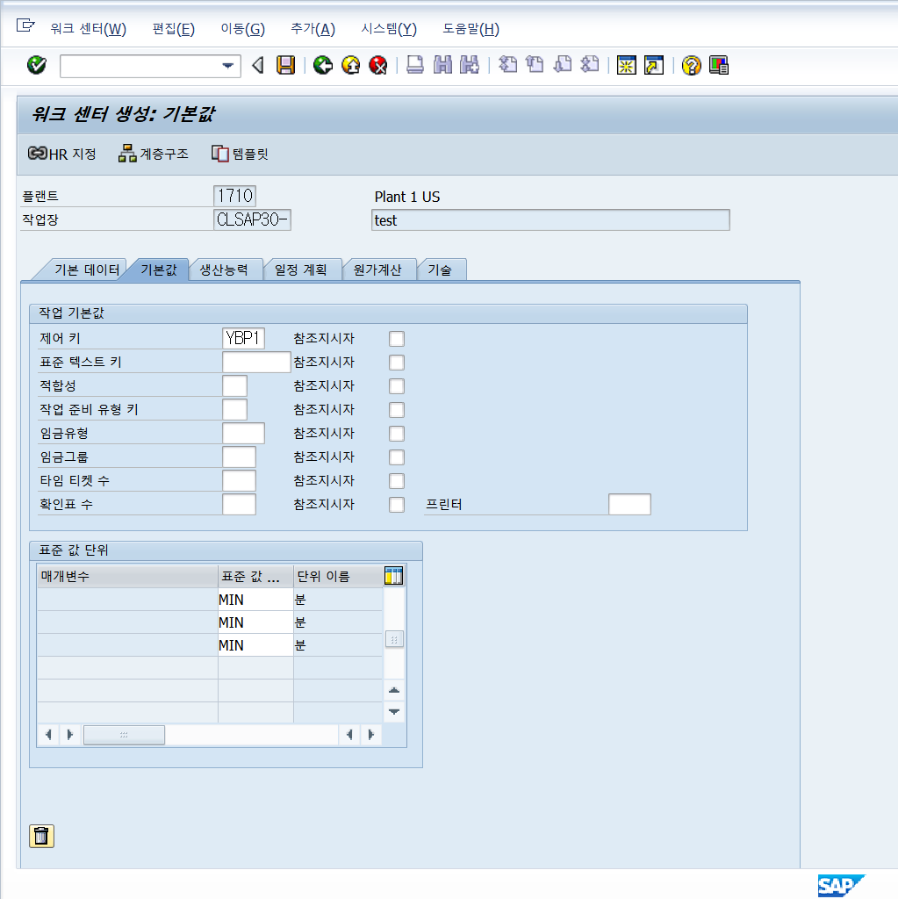
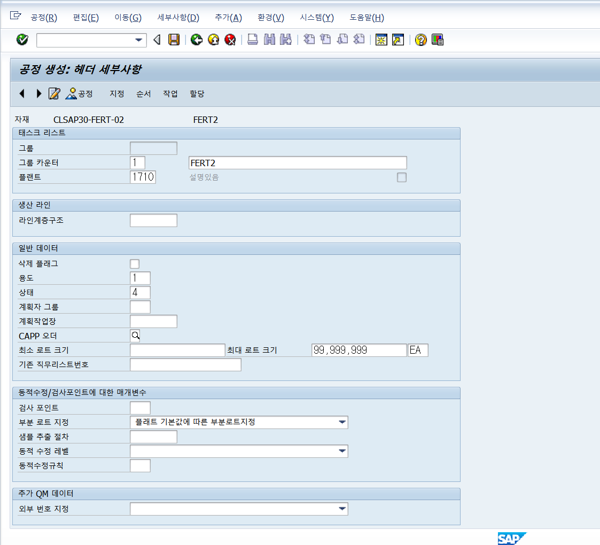
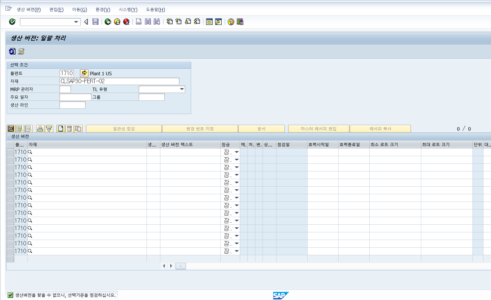
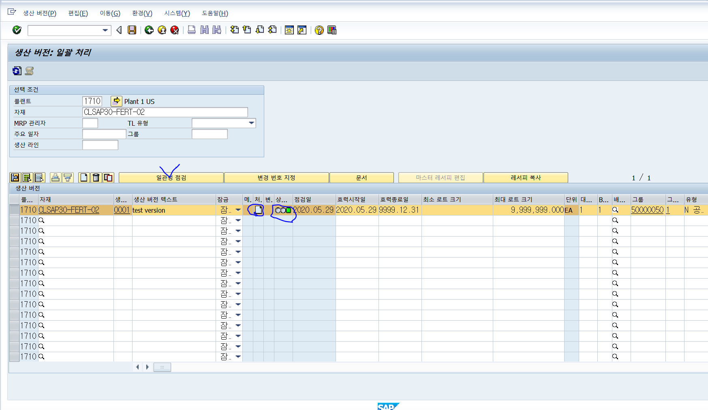

# 0529

구매오더 발행할 최소의 조건 어제까지 했음 / **오늘을 제품을 만드는 공정에 대한 것을 하는 것** &gt; bom과 라우터를 이용해서 표준원가 원자재는 ~~~를 통해서 표준원가해보고 구매오더 발행하고 실제로 공정에 대한 것을 하는게 실습들의 목표

t-code : me1m\(구매정보레코드를 찾는것\) me1l\(벤더코드로 구매정보레코드를 찾는 것\)

t-code: me12구매정보레코드변경 /me11 &gt; 변경가서 구매정보 레코드 세금코드 지웠음. \(5300001552-공급업체코드이자 자재번호 roh 1의 세금코드 \)

판매의 표준원가는 큰의미는 없음, 생산에서 표준원가가 중요 생산에서 원자재에 대한 기준정보를 갖고 자재의 가치평가를 위해 표준원가가 중요함,  

### &lt;생산 - bom&gt;

생산을 위해 설비를 유지보수하기 위한 자재들을 bom으로 구성 유지보수 오더라는 걸 하면 특정 유지보수에 대해 구매요청또는 구매오더가 나갈 수 있다 / 기능위치 pm에서 사용 설비가 위치에 있는 것을 구조적으로 나타내는 bom &gt; bom도 여러가지로 관리할 수 있다

**생산품이라면 만들어야하는 기준정보 4가지** \(자재마스터를 제외한\) \* 공급업체, 

* 공급업체
* 공급업체에 대한 기간계약 \(소스리스트\),
* 단가에 대한 구매정보레코드, 
* 생산에는 BOM/라우팅\(공정에 대한 순\)도 포함됨 
  * 공정이란 ? 각 공정 마다 일어나는 일에대한 작업장-기준정보
* 생산버전: 생산할때 반드시 버전을 필요로 하게 됨 모든 생산에 서\(반복제조, 연속생산 다 포함\) 생산버전별로 생산계획을 할 수 있는 어떤 것을 한다~~ = 다른 원자재,부품의 조함으로 같은게 나올 때 대체 bom과같이 조합의 용도 인데 동일한 생산품인데 어떤 조합이냐 어떤 공정이냐에 따라 특정금액이 나온다 이런 여러다른 생산버전을 가질 수 있다.

\*작업장은 회사 내에서 제조비용을 알기 위해

\*bom은 재료비

\*라우팅은 제조경비\(기계 감가상각비, 노무비 같은 것\) 액티비티 같은 것 때문에 많이 싸우게

## &lt;작업장만들기-공정이 어디에서 작업이 이뤄지는가를 정하는 &gt;

메뉴&gt; 물류&gt;생산&gt; 마스터데이터&gt; 워크센터&gt; 작업장 = CR01 작업장생

생산은 C 구매는 m 영업은 v로 시작하는 티코드가 많음

1. 생성 
   1. 작업장 코드 캐릭터 8자리 **clsap30**로 생성
   2. 워크센터범주: 시스템상의 정의를 해놓는 것 이런 범주일때는 어떤 것을 추출한다~~이런 \(카테고리 개념\) 범주는 0001=기계중심\(설비위주 기계장비들을 통해 이뤄지는 작업\) 0003=노동\(일력위주\),  0005=pm모듈꺼 설비 , 0007 = 생산라인 특정 공정라인을 하나하나지정하는게 아니라 처음부터끝까지 한과정을 하나의 라인으로 통합하는 것 

1. 기본데이터
   1. 책임자: 세세하게 설정하지 않아도 되지만 필수값이면 입력
   2. 위치 QDR은 Qm영역 &gt; mm, sd는 단독으로 움직임 \(bp를 제외하고 자신들만의 테이블로 구성됨\) / pp는 pm과 다른 것과 함꼐 테이블을 사용하는경우가 있음, / 작업장과 라우팅은 같은 테이블을 사용합 생산-라우팅 품질에서는 검사계획, 설비관리일 때는 유지보수계획
   3. 사용: 주로 제한없이 사용하는 009 를 사용, 작업장은 여러 모듈에서 사용하기 때문에 009를 사용하는 것이 나음 / 001 완전 생산 002 검사계회만을 위해서 004 설비 008 pppi \(라우팅 아니라 레시피라고 함 pppi에서는\) 009 직무\(task list type = 이것도 라우팅\)
   4. 백플러시\(논리적출고, 사후처리\): A\(1EA\)라는 완제품에 B\(1EA\), C\(1EA\)라는 반제품 혹은 원자재인 부품으로 생성됨 원래 bom은 단일 업무로 이뤄짐 입고는 입고대로 출고는 출고 대로 &gt; 백플레쉬는 A의 고와 동시에 BC의 출고를 동시에 함, A를 10개 생산하면 B,C를 각각 10씩 자동 출고 하는 것이 **논리적 출고** 이다. 시스템이 매번 자동처리를 하지 못할 때 &gt; **사후처리** 경우1. 블락 B,C에 대한 \(재고나 회계에 영향을 주는 것을 누군가 하고 있을 때\) 락이 걸려서 사용하지 못할 때 경우2. B,C의 재고가 모자랄 때 출고 하지 않음 1개라도 모자르면 출고 불가능 10개출고해야되는데 8개만 있으면 출고 하지 않음 -모자란다는 메세지를 던짐 경우3. 생산 저장위치가 정확히 명시되지 않은 경우 \(생산에서 지정하는 것\) 어디서 출고해야 할지 모를 때 &gt; 백플레시는 이런 에러즉시 상위품 A는 입고만 하게 해줌 로그에 대한 문제가 해결되면 B,C의 출고를 하게 해줌 &gt; 입고출고를 나누거나 혹은 합쳐서 하게 해줌
   5. 표준값키 회사마다 다르게 만들 수 있음 표준 값이란? &gt; 이 작업장에서 뭘 체크할 것인가 = 돈 작업장에서 발생하는 비용 어떤 어떤 항목에서 비용을 측정할 것인가 \(기계가 움직이는 시간, 총인력에 대한 토탈 근무량\(인당시간은 계산이 안됨\), 그 외에 제조경비 - 총 6가지\) 같은 것을 체크 작업장 마다 체크하는 것이 다름 6가지의 조합을 그룹으로 만드는 것이 표준값  작업장 사용하는 공정에대한 실적들을 체크 

 

1. 기본

   1. 제어키만 주로 사용: 제어키는 유형에 따라 2~3개를 사용 / 오버뷰할때 설명해주심 &gt; 실적확인과 입고는 분리된 개념인데 이 작업장은 원가를 계산하는 작업장인가 계획일정이 들어가는 작업장인가 아닌가, 실적과 입고하는 것을 통합할 것인가를 결정하는 것 &gt; 보통 pi, pp, pm, qm등을 설정할 수 있는데 현재는 그게 없어서 YBP1\(일정에 대한계획, cost원가계산하고 , 확정 - 작업시간 확정해야하는 작업장이다. 입고잡는 행위는 따로 해라\(auto GR이라고 써있으면 입고도 함께 처리함\), external proccessing으로 무상사급인지도 설정가능을 사용함  화정에서 1 milestone 이라는 체크를 해주면  GI에서 GR로 가는 각각의 공정마다 작업시간을 확정지어 준다. 
   2. 표준값 단위 &gt; 기본데이타에서 입력한 표준값키를 시간, 분 어떤 단위로 할지를 결정하는 것 &gt; 같은 일인데 D, DAYS를 사용 하는데 미국.유럽으로 나뉘기 때문 아무거나 ㄱㅊ 

1. 생산능력 \(CRP관련된 건데 잘 사용하지 않음\)
   1. 생산가용능력을 \(이 작업장에 대한\) 평가하는 것 작어 단위당을 평가하는 것 &gt; 작업장을 통해 특정량을 생산할 때 작업장에들어가는 시간과 공정들간의 시간을 따져봤을 때 주문오더? 에 시작일과 생산일 작업종료일을 맞출 수 있는가를 판단하는 능력  &gt; 기계가동시간? 인력사용시간? 이런 기준으로 나눌 수 있음

1. 일정계획
   1. 가용범주 \(가동시간\) 001
   2. \(정리시\)processing duration &gt; 시간계산방법 &gt; sap002라는 표준값 사용

1. 원가계산: 작업장을 통한 노시간, 기계사용시간을 const center원가 집계 대에  넣어주는 것 \(조직 혹은 개인,부서\)
   1. 코스트센터: 17101301 \(비용 집계처\)
   2. 엑티비티유&gt; 원가에서는 하나의 행위라고 함 표준값이 아닌 / 생산 직접력 간접인력과 계산하는 것 / 시간을 입력하면 돈으로 바꿔서 계산해 &gt; 해당하는 기계의 계산식을 볼 수도 있음 &gt; 계산식에서 해당하는 공정효율을 볼 수도 있고 수식으로 된 계산도 볼 수 있음 / 사람이나 기계를 돌렸을 때 그걸 금액으로 치완하는 것 
2. 여기까지만 입력하고 저장하면 데이터가 CRHO와 CRHD\_v라는 테이블에 저장됨 보통 CRHD\_V1에서 많이 확인함 / 텍스트는 CRTX에 저장됨 CRHD\_V1에서 어떤 테이블에 작업장에 대한 어떤 데이타를 담고 있는지 확인가능 / 더많은 정보가 필요하면 조인해서 사용이 가능 / 이건 Bapi가 없음 

## &lt;작업장을 활용한 공정을 공정도로 만드는 라우팅 실습&gt;

생산&gt;마스터데이터&gt;공정&gt;공정&gt;표준공정 =CA01 &gt; 생산오더 방식에 적합한 공정을 생 = 자재하나 당이 갖는 공정을 공정시간으로 하는 것 = 각 단계마다 시간이 다

생산&gt;마스터데이터&gt;공정&gt;공정&gt;비율공정 = CA21 &gt; 반복제조에 적합한 공정 생산 방식  = 생산품그룹 당 공정하나 자체를 만들고 어떤 품목에서든 동일한 공정단계와 그 시간으로 똑같이 쓸 수 있는 품목을 동시에 기준정보로 등록하는 것 = 해당 자재? 를 사용하는 시간이 각 단계마다 시간이 같음 

\*둘다 많이 사용한다  / 딱히 반복제조나 생산오더 방식을 가리지는 않음 ㅇ&gt; 품목당 각각의 시간을 관리하는 건지 라우팅당 시간을 관리 하는 건지 방식이 2개 일뿐

지금은 CA01에서 한다.

라우팅 pp = 테스트 리스트 pm= 직무리스트 = 직무계획 Qm&gt;  뭔가를 하는데 그것에 대한 각 작업과 작업의 시간,기간을 정의하는 것 &gt; 라우팅은 무엇에 대해서 어디서 조직구조\(플랜트\) 자재\(조달유형 E,X인 것\)와 플랜트에 대해서 

1. 공정생성 \(내가 만든 자재에 대한\)

   1. 자재코드를 검색&gt; 자재에 대한 bom의 개수와 라우팅의 개수를 곱한 만큼의 조합을 만들 수가 있음
   2. 삭제플래그&gt; 만들긴 했지만 사용하지 않는다는 표시 아예 지우는 것은 아니고 삭제플래그를 이용해서 이력만 남겨두는 테이블이 많다 / bom, 계획오더, 세일즈오더가 이걸 많이 사용
   3. 용도&gt;  1생산 , 3 네트워크, 4 pm\(유지보수계획\),
   4. 상태&gt; 4번으로 거의 사용함 &gt; 4번은 승인/일반, 생성만하는 것, 원가추정만 하는 것
   5. 최소로트 최대로트 &gt; 해당 오더를 통해서 생산하게 되면 생산가능수량의 범위\(생산허용범위\)를 지정 0~99,999,999까지가능

1. 항목 별로 구분되는 아이템에 대한 정보 &gt; 작업 순서
   1. 작업장은 내가 만든 것 아니더라도 갖다 쓸 수 있음
   2. 제어키는 따라옴
   3. 표준 텍스트 키는 신경쓰지 않아도 됨 &gt; 옆칸에 내역에 대한 내용이 모자랄때 공정에 대한 설명을 길게 사용하고 싶을 때 사용하면 
   4.  공정내
2. 라우팅이라 함은 최상위품의 1레벨만 \(최상위와 그것의 직속 부품\) / 부품의 부품은 신경 ㄴㄴ 만약 공정이 4단계가 있다고 치고 4단계를 거쳐서 GR이 되면 1레벨이 어떤 단계에서 수행될것인가를 지정하는 걸 할당이라고 함 &gt; 신규지정가서 지정을 해주면   &gt; 어디에섯 백플러쉬를 사용하는가에 따라 순서가 바뀜 자재에하면 무조건 백플러쉬를 하고 
3. **공정을 그룹 50000050 및 자재 CLSAP30-FERT-02과\(와\) 함께 저장했습니다 &gt; 라우팅 하나 생성 완**
4. **mapl\(대상자재, 라우팅의 용도, 조직, \)/ plko\(라우팅헤더\) / plpo\(라우팅아이템, 라우팅의 상태 로트크기 같은 헤더정보\) 이라는 테이블로 공정을 볼 수 있음**
   1. plko에서 라우팅그룹번호를 찾고 plpo에서 검색하면 apbid를 찾을 수 있음 &gt; 어딘가에서는 키필드지만 어딘가
   2. bapi에서도 할 수 있다 &gt;se37에서 bapi\_routing\_create에서 똑같이 값을 다 넣을 수도 있음 \(공정과정에 대한\)

### &lt;생산버전&gt;

생산&gt;마스터데이터&gt;c223생산버전 = 유지버전 생성변경 여기서 다 함

생산버전의 효력시작일은 bom과 라우팅의 시작할 수 있는 가능일을 써야함 bom이 더 미래라면 bom을 만족하는 날짜로 해야함 

여러가지를 입력해준다.

입력후 상태가 노란색인데 일관성점검을 실행해주면 녹색이 그리고 저장하면 된다~

&lt;bom부터 ~ 복습&gt;

1. 구매정보레코드\(소스리코더\)
   1. 구매품, 공급업체를 만들었고 그것을 구매하는 기준정보를 만드는데 필요한 기준정보 2개 공급처와 공급처와의 **기간계약 단가계약**
   2. **소스리스트를 설정하는 것은 구매오더를 만들기 위해서이다. &gt; migo라는 것을 사용해서 하면 돼서** 

\*\*\*\*

**처음부터 실습하기** 

1. 자재만들기 
   1. CLSAP30-FERT-021 **/** CLSAP30-HALB-021 / CLSAP30-ROH-021
2. 

