# 0602

#### 2일 mm 다음 pp

### &lt;mm주요 트렌젝션&gt;

모듈은 모든 트렌젝션이 맞물려 돌아가는데 물류\(SCM\) 회계\(FCM\) 는 뗄수 없음 하지만 단독으로 보면 서로 영향 받지 않는 것도 많음 

mm이라하면 &gt; 원래 자재관리지만 구매에 집중되는 경향도 있음 , 구매오더, 구매요청 같은 것 원의미는 재고가 움직이는 모든 자재관련된 것 영역이 넓은 편이다.  

오늘하기 &gt; 구매요청, 입고 잡기, 송장발행하기 등

구매오더는 구매요청에 의해 만들어지기 때문에 중요한 키값에 대해서는 구매오더로 넘어가도 바뀌지 않는

자재코드\(원자\) 5가지 

* CT-R01, CT-R02, **CT-R03**, CT-R04, CT-R05 &gt; 내가 사용하는 것 3

1. 구매 요청 만들기 물류&gt; 자재관리&gt; 구매&gt; 구매요청 = me51n
   1. 방법 두 가지
      1. mrp결과로 만드는 것
      2. 필요할 때 수동으로 만드는 것 &gt; 오늘한
   2. 전표입력? 이라는게 있음 카트 모양 옆에 NB구매요청이라는 걸 주로 사용 
   3. 어떤자재를 , 얼마나 필요로 하는지 입력
      1. 품목 &gt; 입력 안해도 자동결정됨
      2. A, I : 
         1. 구매오더로 넘어갈때 그 구매오더의 특성을 자산성구매냐 일반구매냐 외주구매냐 코스트센터구매냐로 정할 수  있음 
         2. A는 계정 지정 범주: account assignment category &gt; 구매하려는 품목에대한 성격
            1. A자산&gt; 우리 회사의 자산을 구매할 경우 여기서의 자산은 가치가 큰 것들 기계\(설비\), fi에서 자산이라고 지정한 것 \(감가삼각대상들 주로 설비류들\) 들을 구매할 때 사용
            2. F: 오더 &gt; 라우팅할 때 외주\(무상사급말고\) 그쪽이 갖는 자산을 살 때 ? 생산오더에 \(공정을 사버리는 것\) 대한 것을 살 사용하는 유형
            3. K 코스트 센터 &gt; \*가장 많이 사용\* 물건에 대해 재고관리를 할 수 있고 안할 수 있지만 우리 회사 내부의 비용으로 처리해버리는 것 \(탕비실\)잡기류들 같은 것 \(재고관리 안하고 비용으로 처리해버리는 것들\), 각각의 부서마다 내부적으로 발생되는 비용이나 거기서 구매오더를 발행할 때 사용하는 유
         3. I는 Item category &gt; 재고의 성격을 정하는 유형
            1. K:위탁 \(고객위탁 고개이 우리 창고에 물건을 맡긴것 하지만 우리 자산은 아닌것 우리가 사용하면 그 때 그때 구매오더를 발행하고 사용한 만큼만 대급지급\) 
            2. L: 외주 \(무상사급을 말함 bom상 특정상위품을 만들 때 하위 원자재를 우리가 사서 상위품을 원자재를 산 회사에 상위품을 팔고 다시 그 상위품을 더해 새로 만들어서 우리에게 파는 것?\) 원자재를 파는 것 / sap시스템상에는 유상사급은 없음 한번 팔리면 재고관리 대상에서 없어지기 때문에 /  무상사급에 경우 bom구조정보가 나타남 
            3. U: 재고이전 &gt; 플랜트간 거래에서 발생하는 것들을 구매오더로 만들 때 \(같은 회사코드 다른 플랜트 생상공장과 물류센타 이때 생산공장에서 물류센타로 옮길 때\) 단순히 이동이 아닌 구매오더를 통해서 물류센타로 납품하는 개념 / 회계문서가 발생하지 않기 때문에 회계적개념은 같지만 재고 변동 시점이 동시에 일어남 \(생산공장 -100 물류센타 +100\) 판매오더가 생성됨 구매오더가 있기 때문에 / 재고이전 구매오더를 갖게 되면 납품해야하는 곳에서는 판매\(납품오더\)오더가 발행
               1. **구매오더**에서 I를 열면 U는 없어지지만 T가 생김 구매오더에서는 U가 아이템 카테고리가 아닌 **독립된 문서 자체로 바뀜 \(UB라는 것으로\)** 실제도 딜리버리오더\(DO\)와 연결이 되면서 문서간의 연결형태가 됨 
            4. **보통 자재구매는 A,I를 특별히 지정하지 않음 \(표준으로 사용\)**
      3. 자재: 자재코드 입력 CT-R03 / account assignment category K\(코스트센터\)의 경우 자재코드 입력 X 입력해도 상관없음 텍스트만 입력해도 됨, \(비용 집계 = 코스트센터에서 함\)  
      4. 남품일 지정 안하면 자동으로 처리 됨
      5. 플랜트: 구매가 발생하는 조직구조 \(1710\) 까지 입력후 엔터
      6. 공급처 지정까지 안해도 되지만 공급처를 지정할 경우 맨아래 공급처 탭에서 공급처 지정으로 지정함 &gt; 두개 이상의 업체에서 동일 품목을 구매할 경우 공급처를 지정할 수 있다. 자재마스터 구매뷰에있는 소스리스트가 체크 돼 있어야함 \(연결 돼 있음\) / MRP실행할 때도 공급처리스트가 체크 돼있어야 공급처를 자동으로 연결해

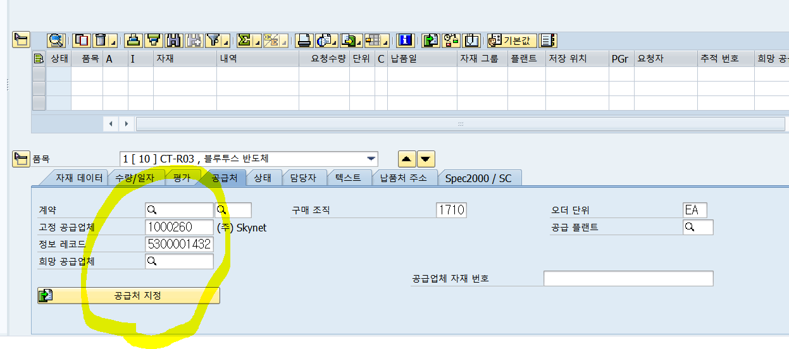

7. 점검: 입력한 정보를 점검한다.

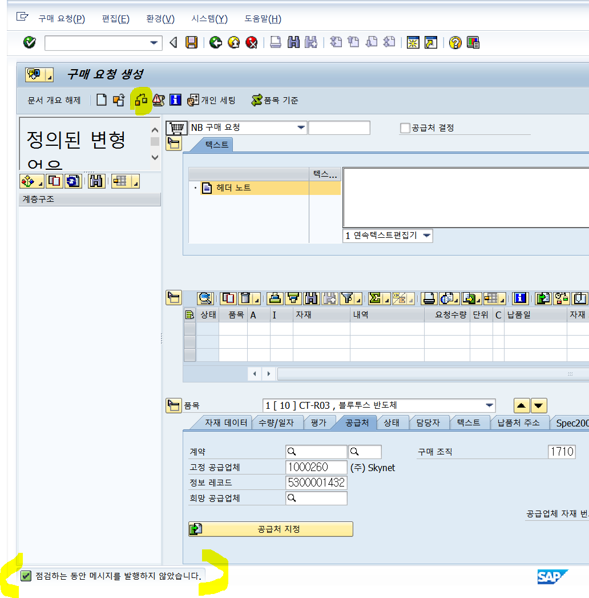

8. 저장

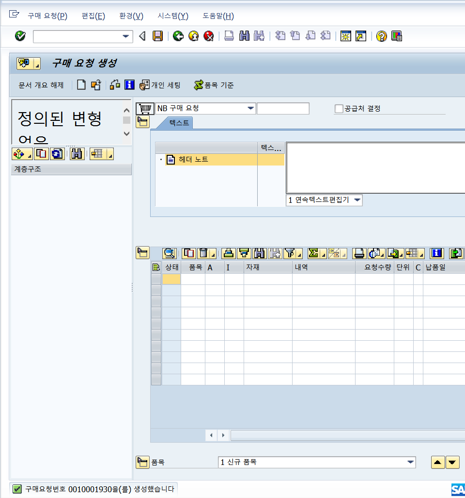

구매요청번호 + 0010002058 도 만듦

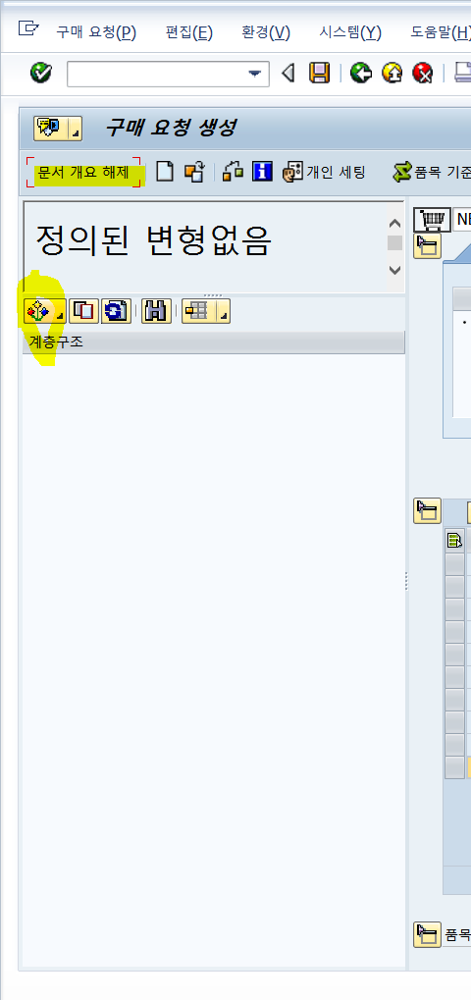

문서 개요 설정을 누르고 튤립모양 아래 구매요청 누르기 

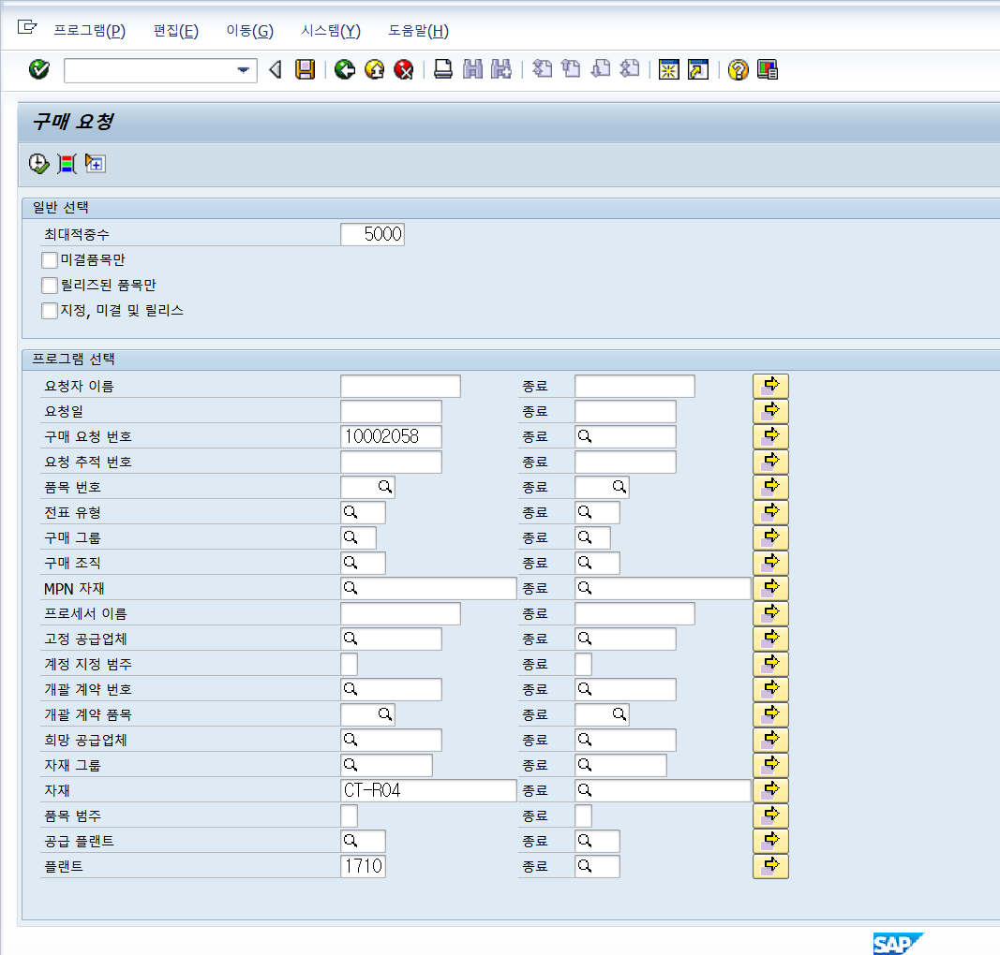

만들었던 자재코드로 조회해 실행

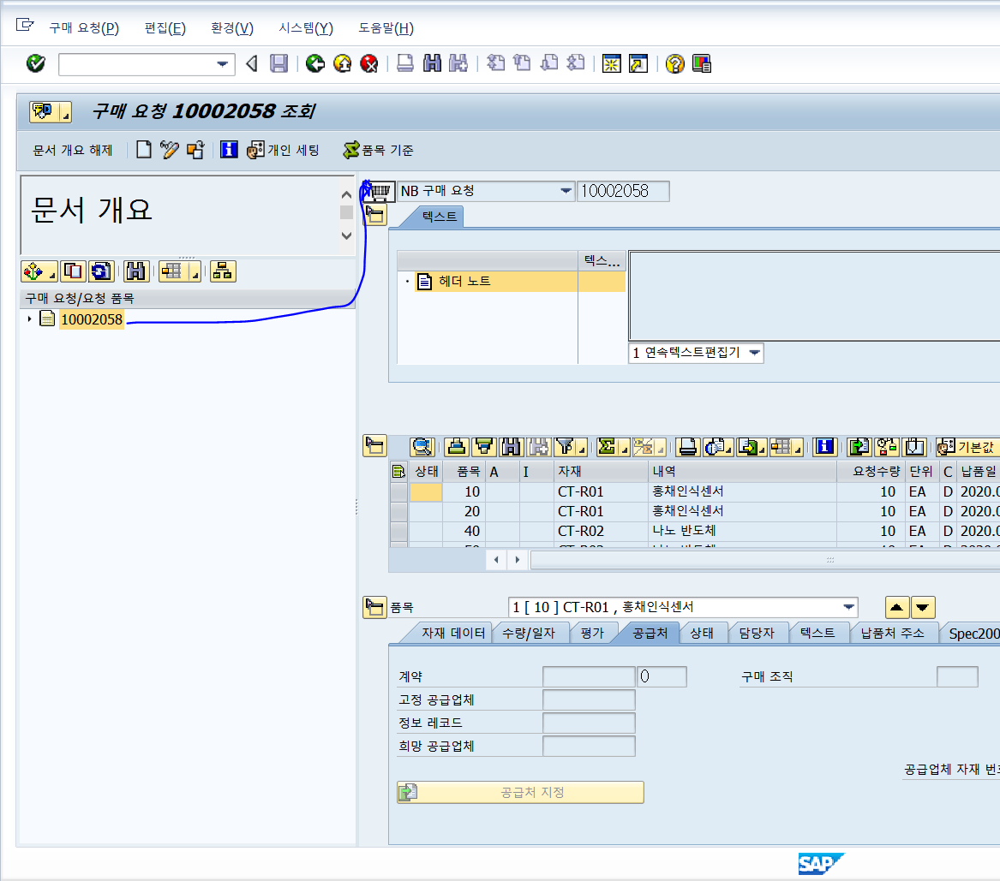

해당하는 자재로 만든 구매요청 조회가 가능 옆에 저 구매요청을 카트로 드레그하면 복사가 됨

EBAN이라는 테이블에 위에 입력했던 구매요청이 다 들어있 가서 세팅&gt; 선택필드&gt; +생성자, 자재코드, 플랜트 추가함

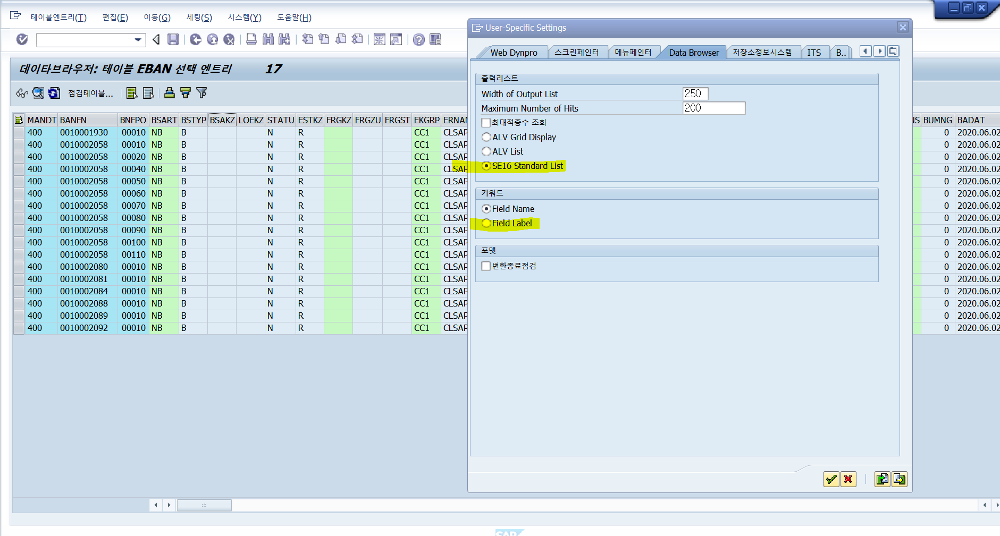

* 업무 포탈이라는 곳에 사용자가 데이타를 입력하면 &gt; sap p/r로 만들어지고 &gt; 다시 업무포탈로 와서 결제 \(승인\) 을 하고 &gt; sap P/O 를 함
*  &gt; 마다  INTERFACE가 일어난다. I/F 타시스템간에 인터페이스가 어떻게 일어나는지를 알아야함 
* 요즘은 EAI라는 연결 솔루션 인터페이스만 담당하는 것으로 인터페이스를 함 타시스템과 타시스템 사이에 연결을 하는 것 요즘은 DB TO DB가 아님

&lt;구매요청으로 오더 만들기&gt; = ME21N, ME59

1. 오더를 읽어와서 요청 만들기
   1. 자동생성된 구매요청이 뭐가 체크 돼있어서 사용하는 경우 ME59
2. 오더를 생성 
   1. ME21N - 오더생 / ME21 - 확장 구매 오더 생성

공급처를 알아야함 구매정보레코드를 갖고 알아낼 수 있음 &gt; ME1M

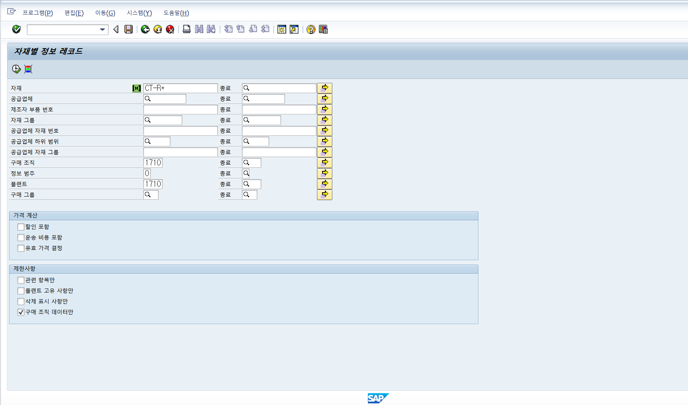

조회

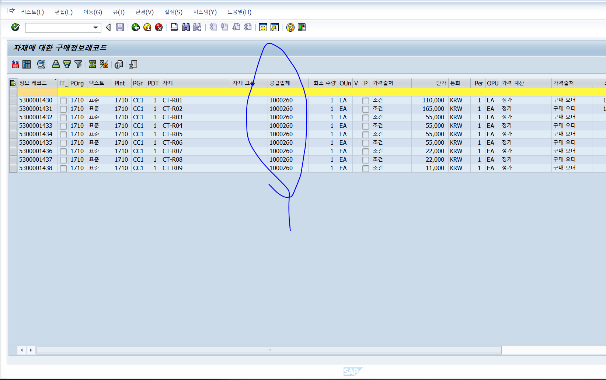

공급업체 번호 조회 

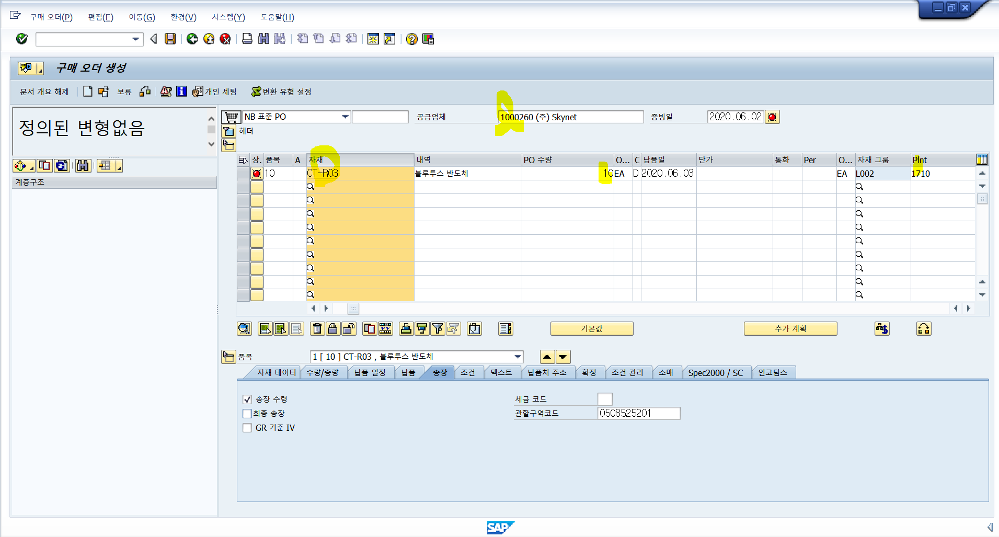

구매조직을 입력하라는 표시가 뜸 /  

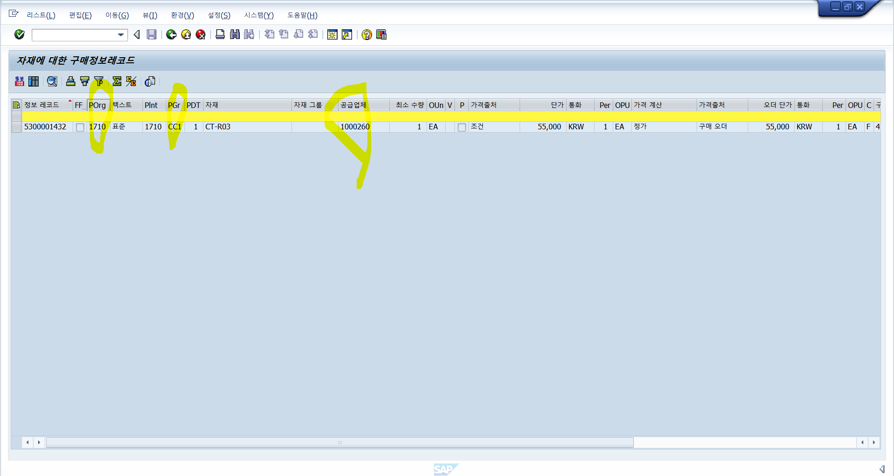

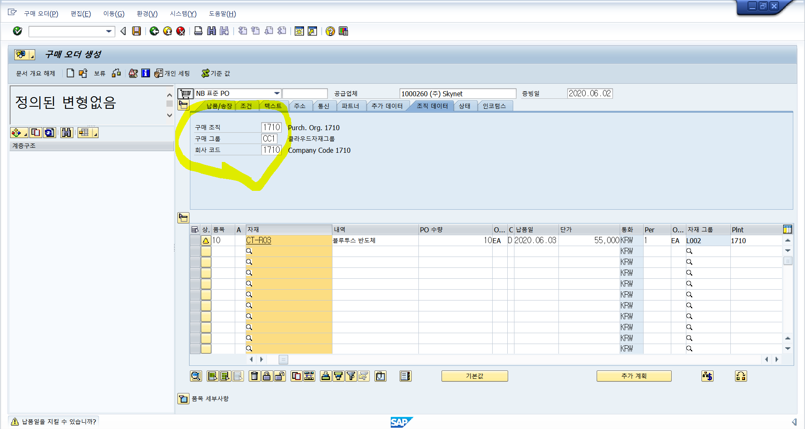

GR = 그룹이라는 약어 G/R과 헷갈리면 안됨&gt; 다 입력하니까 단가가 나옴 자재와 업체라는 건 알지만 구매조직과 구매그룹을 넣어서 유추할 수 있는 구매정보레코드에 있는 단가값을 자동으로 갖고 올 수 있음

요청일 &gt; 구매정보 레코드에 있는 계획납풉일자\(PDT\)를 가져옴 PDT가 1이면 내일 6/3일 6월 3일 쉬는 날이 아니라면 납풉일에 6/3일이 입력됨   

&lt;오후&gt;

* 헤더정보는 하나인데 아이템은 왜 여러개 일까?
  * 지금 발행하는 구매오더에 대한 공통데이타 &gt; 업체자체 , 업체와 거래하는 통화, 조직정보
  * 아이템은 여러개지만 하나의 구매오더에서 거래할 수 있는 업체는 하나라는 것 한 업체와 여러개의 아이템을 거래할 수 있기 때문에 아이템은 여러 품목을 가질 수 있음 
* 회계문서는 라인아이템이 결국 계정이 됨 자재문서와 다르게 하나의 품목당 차, 대변 때문에 \*2가 됨

&lt;품목세부사항-구매뷰, 공급업체뷰에서 가져온 것 같음&gt;

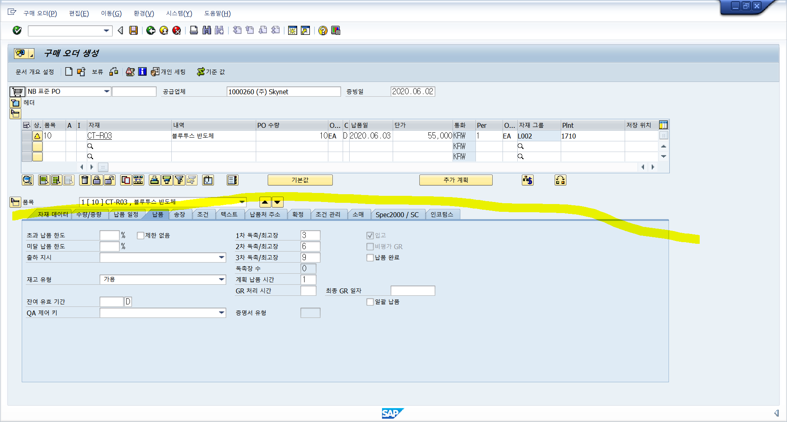

조건 탭에서 CnTy\(condition type\)&gt; 주로 PB00\(시스템이 정해준 가격\), PBxx\(구매오더 생성시 구매정보레코드의 금액이 아닌 수기로 등록한 단가가 있을 때\) &gt; 조건은 내가 지불해야 하는 총가격표를 만드는 것 

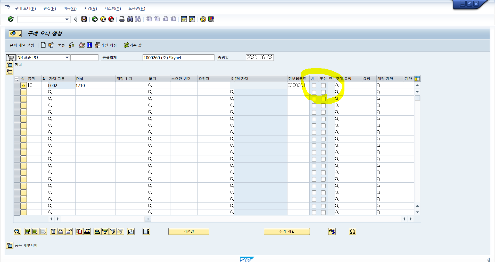

거래가 없을 때 구매오더를 취소 하는 것 &gt; 취소

대금지급이 일어 났는데 다시 물건과 돈을 주는 것 &gt; 반품

### &lt;me59 - 만들어둔 구매요청으로 구매오더 만들기&gt;

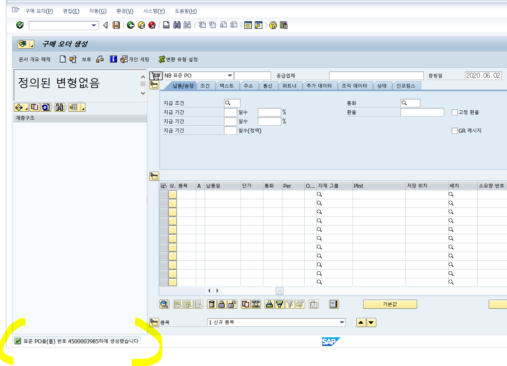

만들었던 구매요청 번호를 구매오더 생성에 아이템라인에 구매요청에 번호를 넣어주면 구매오더 생성가능

&lt;**me59**=만들어둔 구매요청을 위해서 구매오더를 생성할 때의 조건?&gt;

* 자재마스터 구매뷰 자동 po
* BP\(벤더마스터\) 구매자동 po
* 구매요청 header에 공급처 결정
* 구매요청 item detail 공급처 지정 

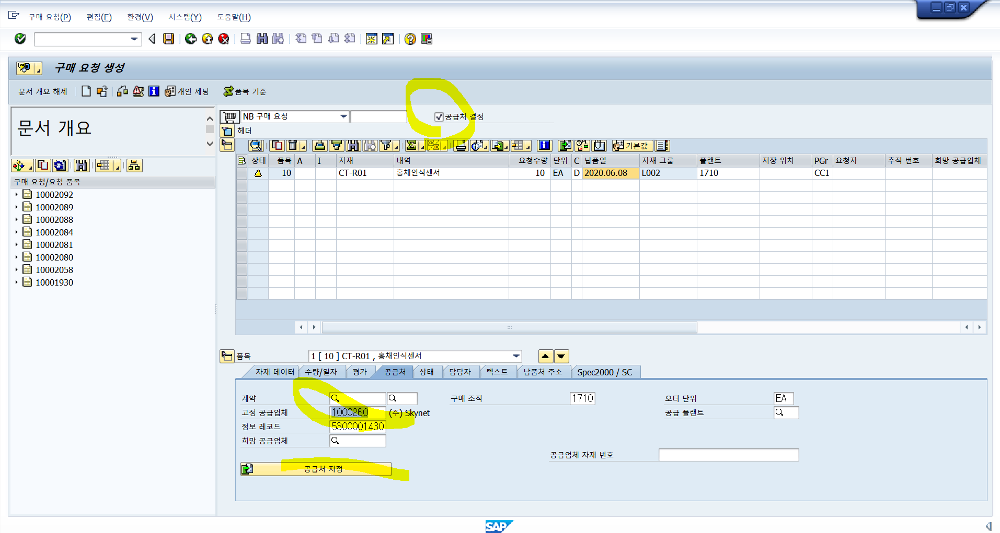

구매요청 다시 만들기 / 공급처 결정 체크 지정하고

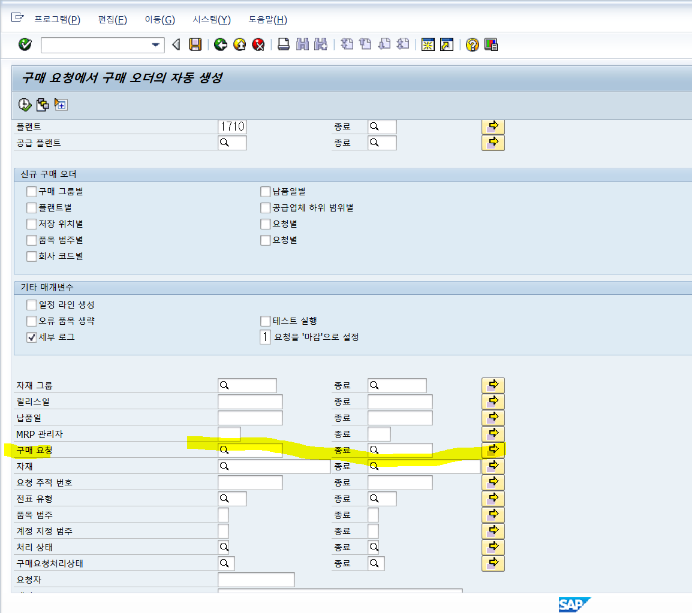

그리고 자동 생성 ME59에서 구매요청 멀티셀렉션 누르고 내가 생성한 구매요청 다 넣어서 구매오더 생성하기 

### 

### &lt;QM모드를 안쓰면 구매오더 후 품질 검증 없이 바로 입고&gt;

EKKO, EKPO 에서 아이템과 헤더에 내용들이 잘 들어있는지 확인

EBAN에서 구매요청을 갖고 만든 구매오더에 연결된 내용을 확인할 수 있다. 구매오더에가 아니라 구매요청에 구매오더가 연결된 것 기준점에 따라 PO가 있기 전에 PR이 먼저 이기 때문에 발주는\(PO\)는 PR이 없어도 생성이 가능하지만 확실한 연결을 위해 PR에 PO가 연결되는 게 맞음

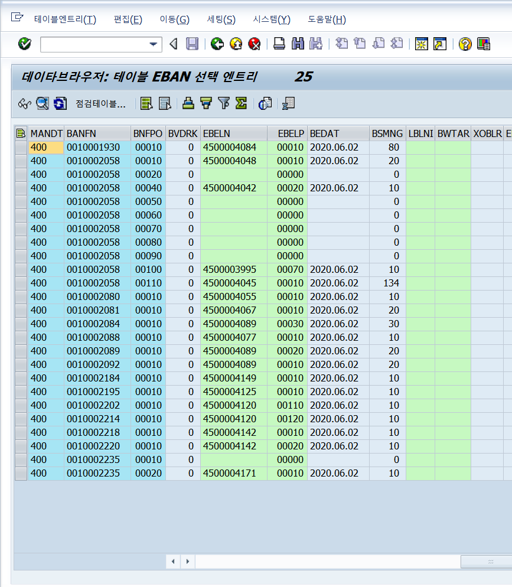

구매요청에 EBELN 구매오더 번호가 연결된 걸 알 수 있음

BAPI\_PO\_CREATE &gt; FUNCTION SE37가서 구매요청없이 구매오더만들기 

\*로컬레이아웃&gt;시각화2&gt;확장검색표시안함 세

DOC\_DATA = 증빙

## &lt;구매입고&gt;

구매입고\(PO\)전에 확정을 위해 승인하는 릴리즈를 사용하는데 - **MIGO**에서 

구매오더를 갖고 입고 하는  맨 위 인풋 입고/ 구매오더/101

구매입고 이동유형 =&gt; 항상 101 &gt;

* 101 일반입고
  * 자산으로 인정되고 재고가 증가하고 회계문서와 자재문서가 동시에 발생하는 것
* 103 우리재고로 들어는 왔는데 자산으로 인식 안하는 경우
  * QM 우리 창고 재고로 잡아두고 오프라인으로, 창고 재고만 잡아두고 상태는 보류\(사용할 수 없는 재고\)로 검수가 다끝나서 우리재고로 인정할 때 105로 넘겨서 인정함 
  * 103재고부터잡고 -&gt; 105자산으로 읹어하는 

수량 100으로하고

* 가용재고 \(unrestricted Stack\): 제한 없이 사용하는 재고
* 제한사용 \(restricted Stack\): 제한있는 것 / 화학에서도 쓰임
* 품질재고\(quality Stack\) / qm모듈 사용 구매입고 검사를 사용한다는얘기를 하면 그건 무조건 품질재고 상태를 사용
* 보류재고\(blocked Stack\): 사용불가 , 막아둔것 \(입고, 출고 등등 폐기나 불량인 것을 빼놓은 \)
* Stack이라고 함 재고는 / 이 상태 간의 이동도 재고 이동이라고 침 

전기일도 2019.11.~일로 바꿈

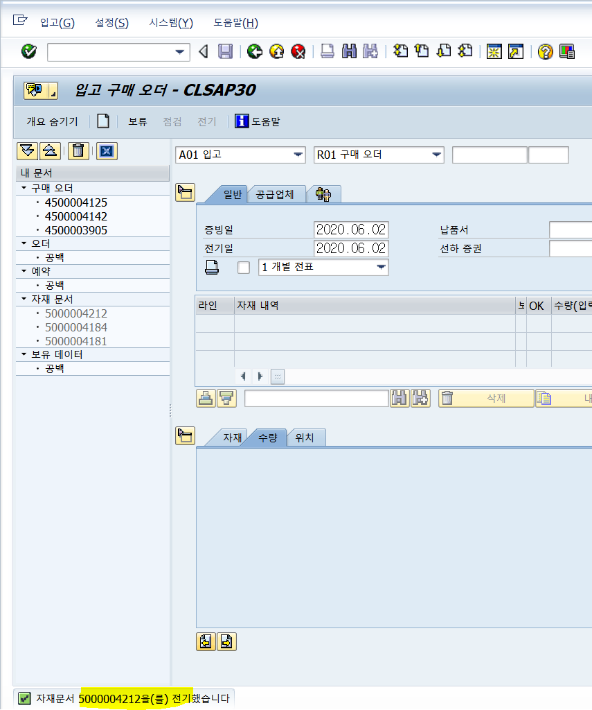

구매입고 까지 완료됨 **me23n &gt; 구매오더 조회** 

## &lt;송장발행 \(세금계산서\)&gt;

물류&gt; 자재관리&gt; 물류 송장 검증 &gt; 송장입력 **miro** 

송장입력 기준 2개

* 구매오더별
* 업체별 로 하는 보편적

송장기준 여기서 정하기 

트렌젝션 송장

* 대변메모: 금액만 처리할 때
* 차후 차변: 금액조정부분 
* 차후 대변: 

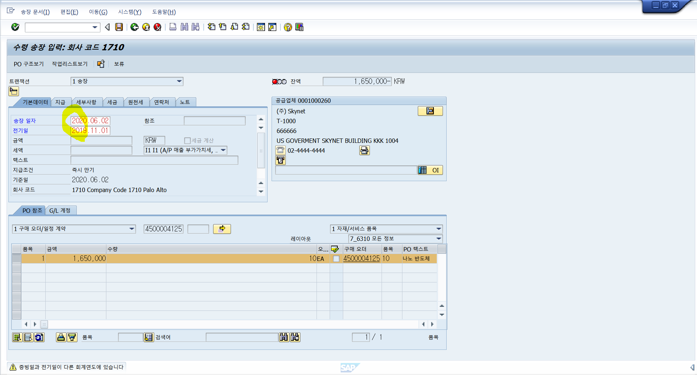

송장일자, 전기일 적고 엔터 &gt; 현재 차-대변이 안맞는 중 밸런스를 맞추는 것이 인보이스의 역할? &gt;현재 -1100만원이라서 금액\(대변\) 1100만원을 입력해줌 

다 입력하고 화면 상단에 시뮬레이션을 해본다.

밸런스 금액이 맞는 것을 확인 할 수 있고 k공급업체 s G/L계정 확인가능

저장하면 송장 전표 메시가 남아 있습니다. 라는게 뜨는데 원래는 그게 아님 그리고 밸런스가 0이 떨어져야

강사님이 보여주시는 것 &gt; 

구매오더 4500004225 조회해서 따라하거나 그 구매오더로 송장발행하기

공급업체 코드 &gt; ussu-vsf04 = 1000260

&lt;여기가 mm기본적인 흐름 하나 완료한 것&gt;

