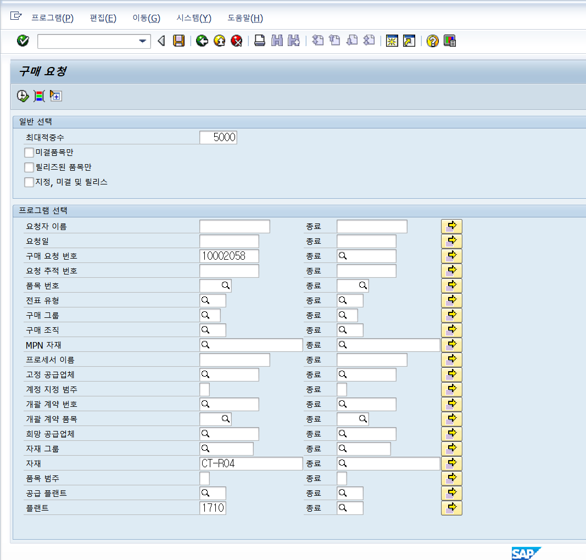
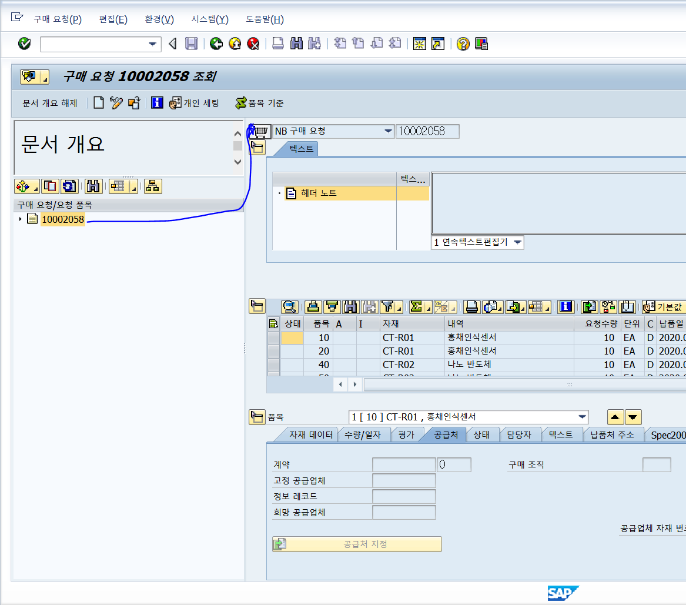

# 0602

#### 2일 mm 다음 pp

### &lt;mm주요 트렌젝션&gt;

모듈은 모든 트렌젝션이 맞물려 돌아가는데 물류\(SCM\) 회계\(FCM\) 는 뗄수 없음 하지만 단독으로 보면 서로 영향 받지 않는 것도 많음 

mm이라하면 &gt; 원래 자재관리지만 구매에 집중되는 경향도 있음 , 구매오더, 구매요청 같은 것 원의미는 재고가 움직이는 모든 자재관련된 것 영역이 넓은 편이다.  

오늘하기 &gt; 구매요청, 입고 잡기, 송장발행하기 등

구매오더는 구매요청에 의해 만들어지기 때문에 중요한 키값에 대해서는 구매오더로 넘어가도 바뀌지 않는

자재코드\(원자\) 5가지 

* CT-R01, CT-R02, **CT-R03**, CT-R04, CT-R05 &gt; 내가 사용하는 것 3

1. 구매 요청 만들기 물류&gt; 자재관리&gt; 구매&gt; 구매요청 = me51n
   1. 방법 두 가지
      1. mrp결과로 만드는 것
      2. 필요할 때 수동으로 만드는 것
   2. 전표입력? 이라는게 있음 카트 모양 옆에 NB구매요청이라는 걸 주로 사용 
   3. 어떤자재를 , 얼마나 필요로 하는지 입력
      1. 품목 &gt; 입력 안해도 자동결정됨
      2. A, I : 
         1. 구매오더로 넘어갈때 그 구매오더의 특성을 자산성구매냐 일반구매냐 외주구매냐 코스트센터구매냐로 정할 수  있음 
         2. A는 계정 지정 범주: account assignment category &gt; 구매하려는 품목에대한 성격
            1. A자산&gt; 우리 회사의 자산을 구매할 경우 여기서의 자산은 가치가 큰 것들 기계\(설비\), fi에서 자산이라고 지정한 것 \(감가삼각대상들 주로 설비류들\) 들을 구매할 때 사용
            2. F: 오더 &gt; 라우팅할 때 외주\(무상사급말고\) 그쪽이 갖는 자산을 살 때 ? 생산오더에 \(공정을 사버리는 것\) 대한 것을 살 사용하는 유형
            3. K 코스트 센터 &gt; \*가장 많이 사용\* 물건에 대해 재고관리를 할 수 있고 안할 수 있지만 우리 회사 내부의 비용으로 처리해버리는 것 \(탕비실\)잡기류들 같은 것 \(재고관리 안하고 비용으로 처리해버리는 것들\), 각각의 부서마다 내부적으로 발생되는 비용이나 거기서 구매오더를 발행할 때 사용하는 유
         3. I는 Item category &gt; 재고의 성격을 정하는 유형
            1. K:위탁 \(고객위탁 고개이 우리 창고에 물건을 맡긴것 하지만 우리 자산은 아닌것 우리가 사용하면 그 때 그때 구매오더를 발행하고 사용한 만큼만 대급지급\) 
            2. L: 외주 \(무상사급을 말함 bom상 특정상위품을 만들 때 하위 원자재를 우리가 사서 상위품을 원자재를 산 회사에 상위품을 팔고 다시 그 상위품을 더해 새로 만들어서 우리에게 파는 것?\) 원자재를 파는 것 / sap시스템상에는 유상사급은 없음 한번 팔리면 재고관리 대상에서 없어지기 때문에 /  무상사급에 경우 bom구조정보가 나타남 
            3. U: 재고이전 &gt; 플랜트간 거래에서 발생하는 것들을 구매오더로 만들 때 \(같은 회사코드 다른 플랜트 생상공장과 물류센타 이때 생산공장에서 물류센타로 옮길 때\) 단순히 이동이 아닌 구매오더를 통해서 물류센타로 납품하는 개념 / 회계문서가 발생하지 않기 때문에 회계적개념은 같지만 재고 변동 시점이 동시에 일어남 \(생산공장 -100 물류센타 +100\) 판매오더가 생성됨 구매오더가 있기 때문에 / 재고이전 구매오더를 갖게 되면 납품해야하는 곳에서는 판매\(납품오더\)오더가 발
            4. **보통 자재구매는 A,I를 특별히 지정하지 않음 \(표준으로 사용\)**
      3. 자재: 자재코드 입력 CT-R03 / account assignment category K\(코스트센터\)의 경우 자재코드 입력 X 입력해도 상관없음 텍스트만 입력해도 됨, \(비용 집계 = 코스트센터에서 함\)  
      4. 남품일 지정 안하면 자동으로 처리 됨
      5. 플랜트: 구매가 발생하는 조직구조 \(1710\) 까지 입력후 엔터
      6. 공급처 지정까지 안해도 되지만 공급처를 지정할 경우 맨아래 공급처 탭에서 공급처 지정으로 지정함 &gt; 두개 이상의 업체에서 동일 품목을 구매할 경우 공급처를 지정할 수 있다. 자재마스터 구매뷰에있는 소스리스트가 체크 돼 있어야함 \(연결 돼 있음\) / MRP실행할 때도 공급처리스트가 체크 돼있어야 공급처를 자동으로 연결해

7. 점검: 입력한 정보를 점검한다.

8. 저장

구매요청번호 + 0010002058 도 만듦

문서개요설정을 누르고 튤립모양 아래 구매요청 누르기 

만들었던 자재코드로 조회해 실행

해당하는 자재로 만든 구매요청 조회가 가능 옆에 저 구매요청을 카트로 드레그하면 복사가 됨

EBAN이라는 테이블에 위에 입력했던 구매요청이 다 들어있 가서 세팅&gt; 선택필드&gt; +생성자, 자재코드, 플랜트 추가함

* 업무 포탈이라는 곳에 사용자가 데이타를 입력하면 &gt; sap p/r로 만들어지고 &gt; 다시 업무포탈로 와서 결제 \(승인\) 을 하고 &gt; sap P/O 를 함
*  &gt; 마다  INTERFACE가 일어난다. I/F 타시스템간에 인터페이스가 어떻게 일어나는지를 알아야함 
* 요즘은 EAI라는 연결 솔루션으 인터페이스만 담당하는 것으로 인터페이스를 함 타시스템과 타시스템사이에 연결을 하는 것 요즘은 DB TO DB가 아님

