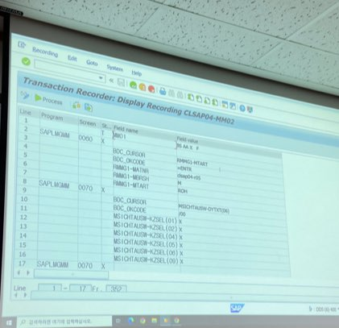

# 0805

&lt;bapi를 이용한 프로그램 만들기&gt; =bapi &gt; me23n

* 구매오더 : 구매처 삼성전자\(공급업체 하나에서 사오는 것이 구매 오더\), 일자 2020.08.05
  * 구매오더는 하나의 공급업체에서 사오는 것
  * 구매오더의 아이템 즉 하나의 공급업체에서는 여러 물건을 사올 수 있기 때문에  구매오더와 아이템은 1:n 

| No\(key\) | 물품\(key\) | 수량 |
| :---: | :---: | :---: |
| 물품1 | 노트북 | 5ea |
| 물품2 | 모니터 | 5ea |
| 물품3 | 키보드 | 5ea |
| 물품4 | 공기청정기 | 5ea |

* 테이블에 데이타를 insert하는 것이 가능한데 절대 db tab에 하면 안됨. cbo tab만 건들여야함 / 스텐다드 테이블은 절대 건들면 안됨!!!!!  / 
* alv &gt; bapi 구매문서 생성할 줄 알아요 ~~&gt; 자재문서 생성할 줄 압니다~~~~~~~~~ 
  * bapi = function을 호출하는 것 &gt; 
  * 

이 탭들이 function의 파라미터들이다 각각의 탭에 어떤 값이 들어가는지 잘 알아야 function을 호출해서 사용할 수 있음 /  디폴트값이 있거나 사용자가 꼭 넣지 않아도 되는 값은 빼고 만들어 줄 수 있음 . 

* function 생성시 remote-module 을 체크하면 외부\(자바나 웹이나\)에서 사용할 수 있음 &gt;&gt;&gt;&gt; 파라미터만 적철히 넣으면 자바에서도 구매오더 생성가능  RFC but 거의 99퍼 내부적으로 사용한다

* function에서 파라미터에 optional이 체크 돼 있으면 꼭 안넣어도 됨 long text 버튼이 있으면 파라미터에 대한 설명이 있음  
*  bapi는 반드시 commit을 콜해줘야함. \* &gt;&gt;&gt;&gt;&gt;&gt;&gt;&gt;중요
* * 

tables에 있는 건 모두 테이블 형태 

bapiretun은  실패시 e type을 반환하고 message를 띄움 

&lt;bapi와 bdc = 스텐다드를 흘려보는 방법 2가지 &gt; 

* bapi 호출 해서 쓰고 bdc는 me24n을 사용 바피  me22n 을수행하는 화면 레코딩\(화면을 기록하는 것\) &gt;&gt;  bapi랑 bdc 다른 

이렇게 화면 레코딩을 하는게 BDC 임 t-code로 

tcode에 해당하는 bapi가 있는지 보고 없으면 사용 못함 .

다른 패키지로 옮기는 법

이 해더 정보들을 바꿀거임. &gt; 저 두개 f1 눌러서 파라미터 이름을 확인해볼 것 그걸 갖고 프로그램에서 바꾼다고 지정해주는 것 

* 왜 직접 하면 안될까 &gt;&gt;&gt; 바피를 이용해야하는 이유 &gt;&gt; 다 처리 된 상황에서 EKKO의 DB 데ㅣㅇ타를 바꾸며 ㄴ 직접하면 안됨 바피를 이용하면 바꿔도 되는 지 체크를 해줌 . 

